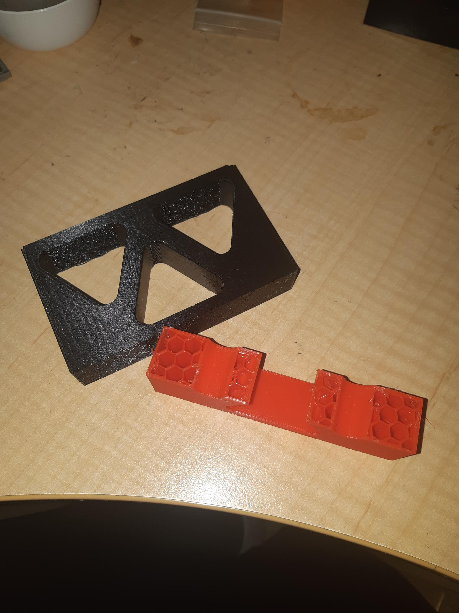
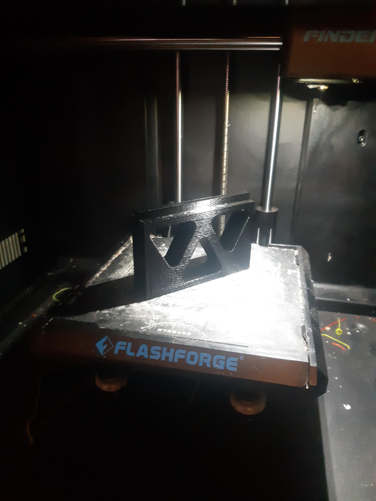
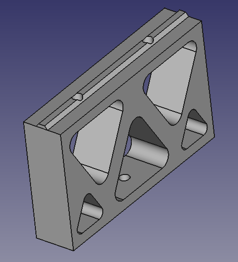

I still think the FlashForge Finder I bought, to kit my hobby "manufacturing" world off was a brilliant buy.

It is really a forgiving system.

Upgraded with Swiss full metal hot end, so no appreciable clogging now.

Must be pushing the printer, as I had to swap out the flat cable that goes to the print head, as well as the pcb that sits in the x-axis, to fix a problem likely due to header connection for the flat cable, no longer seating properly and causing missing layers in the prints (according to FlashForge) due to an intermittent connection.

So, to finally (really accidently) test out the bridging option seriously, which was a joy to behold.

Figure 1

In Figure 1, the red half print is, of course, me forgetting to check the spool had enough filament, before printing.

The piece is for the simpler, cheaper, PnP machine design of mine.

It was a draft, crafted in FreeCAD. Thrown together and printed to check out a few things.

Of note, I had it standing up on the bed (see Figure 2). I hadn't thought it through. I went to check it just as it got to the point of closing two the penetrations at the top. I didn't baulk, I guessed I was about to find out how good the bridging was on this old workhorse. The span is 35mm odd. Probably not a world record BUT I do thing I should use this option more often.

Figure 2

The final design is at Figure 3.

Figure 3
