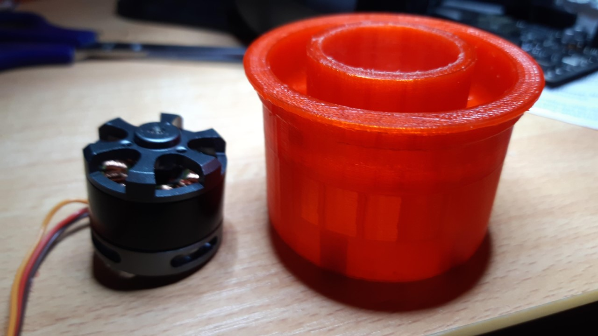
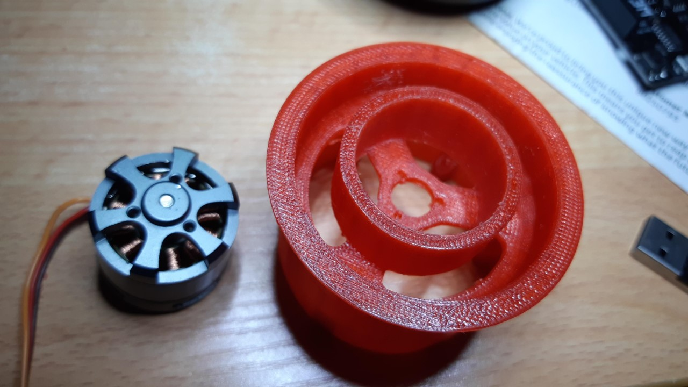

So, I did a print of the wheel hub. It turned out I tight fit. Too tight to insert the motor without having to sand the inner surface of the collar that will hug the outrunner.

I snuck back into the model to shave a tad off for the next print. The collar will help fit the wheel square onto the outrunner to prevent wobbling.
