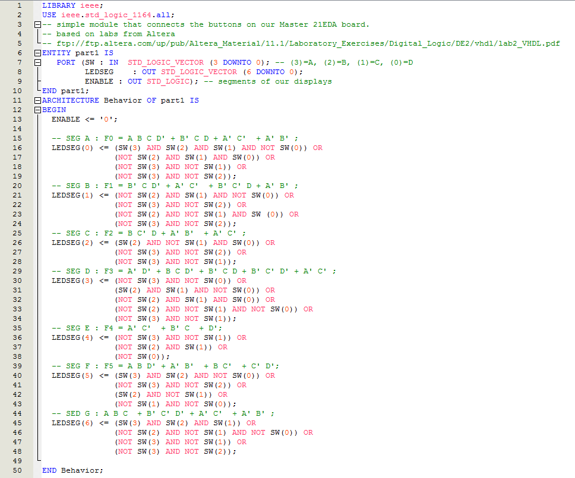
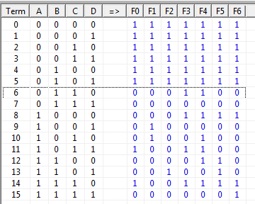
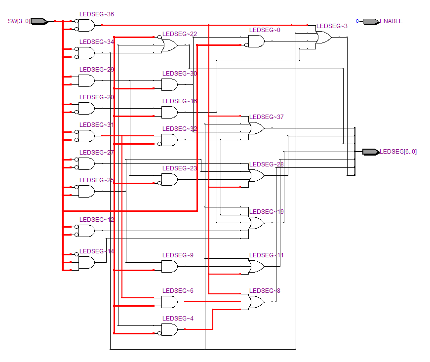
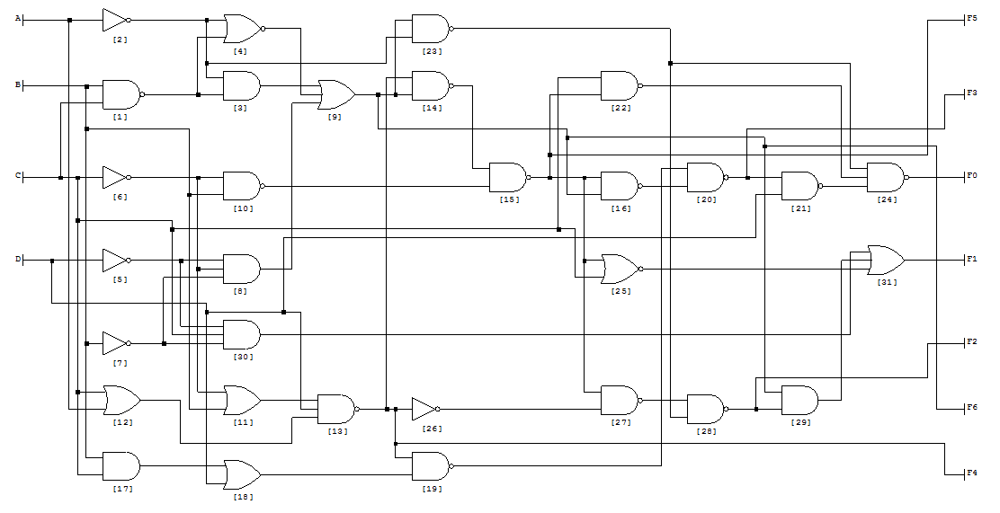

[caption id="attachment\_1629" align="aligncenter" width="660"] Not quite right but ...[/caption]
... it should be.  Segment 'B' seems to want to light up when buttons are set to b'1010 and b'1011 (aka 10 and 11).
This is odd because the logic table is:
[caption id="attachment\_1630" align="aligncenter" width="300"] Hmmm[/caption]
Now, before you start, remember the logic had to be inverted to account for the inversion of the switch circuitry - so count from 0 up from the bottom.  Term 6 is actually then '9' and '10..15' is terms 5..0.  Notice all the outputs are 1's post 9 as the Lab 1 of tutorial 2 requires.  Segment 'B' is output 'F1'.
Minimized it gives us this:
F0 = A B C D' + B' C D + A' C' + A' B' ;
F1 = B' C D' + A' C' + B' C' D + A' B' ;
F2 = B C' D + A' B' + A' C' ;
F3 = A' D' + B C D' + B' C D + B' C' D' + A' C' ;
F4 = A' C' + B' C + D';
F5 = A B D' + A' B' + B C' + C' D';
F6 = A B C + B' C' D' + A' C' + A' B' ;
[caption id="attachment\_1631" align="aligncenter" width="660"] Hmmmm[/caption]
So, I may have to work through this as the logic.  First I will convert the LogicFriday version into gates and code it into Deeds to see if it is actually wrong or if the compiler is doing something funny.  Although, this is what will need to go into Deeds:
[caption id="attachment\_1634" align="aligncenter" width="660"] Grrrrrrr![/caption]
