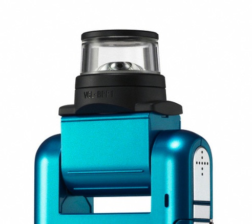

So, Bloggie webcam on PC so far.
The original bloggie has no webcam mode.  I have bought two second hand cameras mostly to get hold of the 360degree lens for use on my Android phones or devices.
[caption id="attachment\_1131" align="aligncenter" width="300"] Omni but no webcam.[/caption]
[caption id="attachment\_1272" align="aligncenter" width="169"] Bloggie Lens used on an Android Phone (with Processing Unwrapping the 360degree image.[/caption]
Now, I have a Bloggie Duo (and am waiting on a second) as they have a webcam mode.
[caption id="attachment\_1133" align="aligncenter" width="300"] Omnis PLUS webcam.[/caption]
The aim is likely to pair them with an Odroid-W to do a wifi based sensor - hopefully there is a driver that will work with them.
The Bloggie Duo has an inbuilt battery so it can simply feed an image processing app, running on the nano-Linux-beast that is the Odriod-W, via its USB Webcam mode.  Now, I did buy a couple to three of the Raspberry Pi camera modules for the Raspberry Pirate (aka Odroid-W), but the option of a USB camera also appeals.
Now in the meantime, for prototyping, I have been trying to use Processing on my PC.  The Android mode for Processing, using Ketai, has proven a bonus as I have code for unwrapping the video from the Bloggie lens on my Samsung S2.
However, Java mode for Processing, on my PC, does not seem to be happy with the Bloggie.  It can see and list the Bloggie in the camera list BUT does not raise a capture event.
I found a Java [webcam library](http://webcam-capture.sarxos.pl/) that can see and lift video PLUS still off the bloggie so I started playing with it to see if I can use that Java library in Processing on my PC.
First thought was build a Processing library (wrapping the Java library) BUT you can actually tell the Processing IDE simply to pull a JAR file into your sketch and then it silently loads the JAR for you.  Processing is really just a DSL for Java and hides some of the complication so I was happy to be able to simply load the JAR into a sketch and start playing with the Bloggie Duo (finally).
One nuisance though is one must convert from a standard Java [BufferedImage](http://docs.oracle.com/javase/7/docs/api/java/awt/image/BufferedImage.html) to a Processing [PImage](https://processing.org/reference/PImage.html).
Suspicion is currently that one uses the [BufferedImage.getRBG()](http://docs.oracle.com/javase/7/docs/api/java/awt/image/BufferedImage.html#getRGB(int,%20int,%20int,%20int,%20int[],%20int,%20int)) method with the [PImage.pixels[]](https://processing.org/reference/PImage_pixels.html). This assumes PImage.pixels[] is an RBG array.  There is some example Processing code which seems to confirm this so fingers crossed.
In any event, the video library that comes with Processing is of little use to me if it can't grab an image from the Bloggie.
