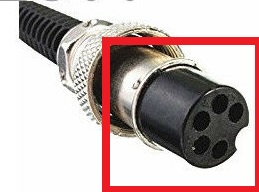
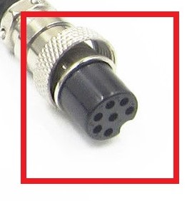

So, ordered a range of gadgets from Aliexpress for my soldering station, post the [apocalypse](https://organicmonkeymotion.wordpress.com/2021/05/14/woo-hooooo/).

I did originally order a single second 7-pin/hole soldering iron and a range of tips.

I wanted to refurbish the iron that was involved in the apocalypse, and opted to make a second order of spare barrels, elements and two additional 7-pin/hole soldering irons.

I intended to refurbished the original iron with a new barrel and tip, rather than toss it - despite them being dirt cheap.

I thus opted to order in additional spare barrels and two additional 7-pin/hole soldering irons. So that would be 4 irons all up.

The second batch was from the original vendor as the first 7-pin/hole soldering iron. That iron turned up no problem and worked a treat ... because it was a 7-pin/hole setup that my soldering station required.

My heart sank when I opened the package as the two additional irons were 5-pin/hole soldering irons.

DOH!

When I approached the vendor, they claimed evidence that they sent 7-pin/hole units. We are now, of course, in dispute. They are not denying that I ordered 7-pin/hole units. They are denying that I had not receive 7-pin/hole units. That is, they are denying that I had received 5-pin/hole units. Even with photo and video evidence.

Yeah, I know ... it's soooo complicated right?!

https://www.youtube.com/watch?v=1Sfma7iNsBU

Ali the Crapper!

Please watch out where you're stepping. The additional 4 holes (2 from each soldering iron) fell out of the package somewhere between China and South Australia. If you find them, please PLEASE don't step on them as they may be able to be re-inserted.

Here's what they look like. Have you seen them?

5!

7!

All may not be lost as there are nutters out there building their own controllers for the 5-pin version of the "Hakko" 907.

https://www.youtube.com/watch?v=gd2W-boIRPo

I say "Hakko" since there is no 907 on the Hakko site I can find, so very likely we are working with "named" copies. No problem as the irons have be working fine - hell, they're AUS$10.

UPDATE

So, the dispute over the soldering irons was closed in my favour. That was on the basis that the vendor got it wrong, that the postage from Australia to China (with tracking) would cost more than the articles and so either a refund or the vendor sending the 7-pin were the only solution. I got the refund, so I need look at sourcing the irons from another vendor.

The connectors for the soldering iron appear to be GX-16 types, with the barrel is 12.4mm to the apparently required 12.5mm by standard. So, I will probably opt to building a controller for 5-pin irons so that feather is in my cap. Low priority though. Boards order from PCBWay to put in the todo pile.
