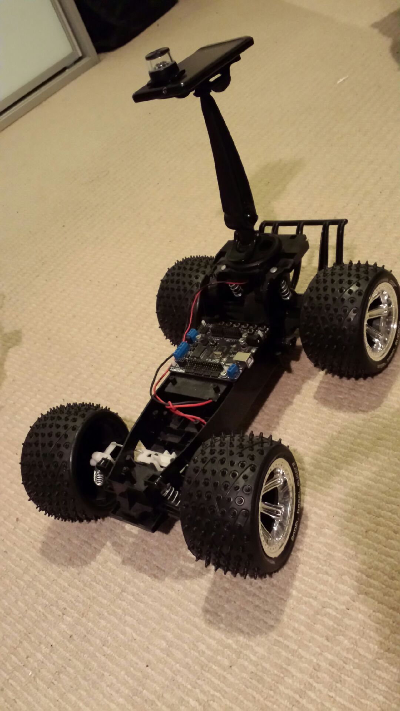
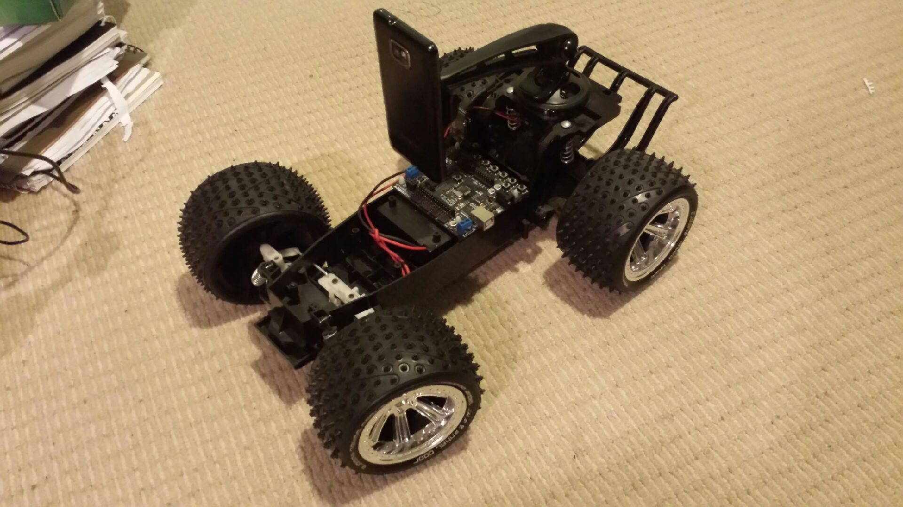

[caption id="attachment\_1272" align="aligncenter" width="450"] Cyclops![/caption]
Feast your eyes!
The beautiful accidents right.
The GripGo base, once I ripped the suction cup off (broke off without actually any resistance) was a couple of millimeters in diameter larger than a circular "ledge" on the back of the indoor rover so a liberal smear of epoxy and voila!!  An adjustable mount for my old Samsung SII.
Do notice the omnidirectional lens on the top.  That is a "spare" that turned up.  Cost $60 but came with an old knock about bloggie which I will find some other use for.
Unfortunately the second bloggie fell through, the poor dear at the other end of the interweb was too dull to know how to mail something interstate - oddly, this one comes from twice as far away.  Can't fathom it but there are still Luddites around.
Anway, I have two of these lens as well as the "periscope" version (that I am waiting on the USB catheter camera).  So, plenty if you ask me.
I will need to get a student copy of Matlab to use a fancy calibration library which looks like it lifts any distortion out of the image once it is unwrapped.  Even if that falls through, a simple wall detector will allow this beast to avoid bumping into walls - we hope ... mwahahahahaha!
Recall the phone runs S4A and Python so while the application will be in C++ or Android it can ping a socket with steering directions - or that is the plan.
Beauty is that the adjustable holder allows other configurations when other algorithms and vision approaches are being played with.
[caption id="attachment\_1276" align="aligncenter" width="450"] Nope, same Rover.[/caption]
