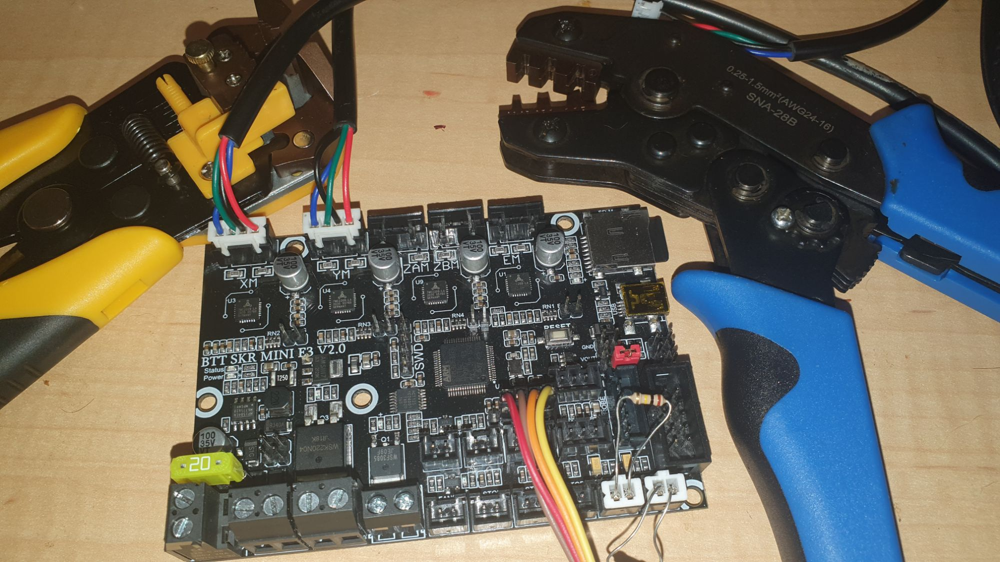

This weekend I got around to knocking up a step cum ramp for our two poor old tired dogs to get up/down from the bed. Then, cleaned out ponds back and front yards. Then sat down to some wiring.

[Based upon my research](https://organicmonkeymotion.wordpress.com/bear-setup-journey/m-m-m-motors-niff-naff/), I got the X and Y leads of the Prusa Bear clone crimped and setup for the first steps to get it moving.

It makes sooooo much difference with the right tools.
