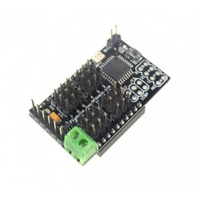
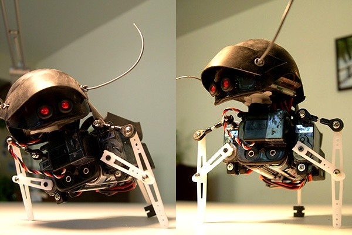

So, a Usurper!  I fiddled with the Films and will find something else for them to do.

This new board from DFRobotics is PERFECT for a Swashbot project.  I have one coming along with a XBee/USB board (you can see the XBee socket underneath.
So, will need to build gaits into board and pass sensor data back to laptop for moving around room.

I will use larger servos as I am hoping the thang'll carry a small android phone as well.  I have been playing with video streaming from android devices and so the field is open.
With 12 pwm outputs it can have a couple of extra servos with IR scanners, and with 8 analog inputs the IR scanners can be backed up with resistor whiskers for close in bumps.
There is also a prospect for some sort of animatronic bird chaser.  Pesky birds are eating the vegetables in the yard so something to flail and make noise when it detects motion close by.
