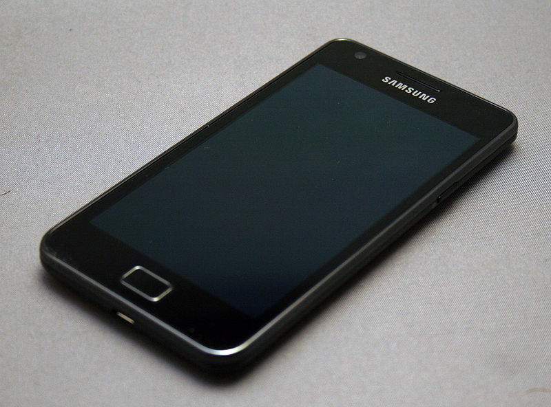
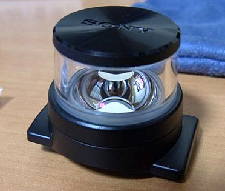

My phone contract was coming to an end so as usual they contacted me early to smooch me to keep me on and offer me a new phone.  I opted for the Samsung Galaxy S II (of course) since I wanted the later version of Snapdragon that would work with the [Qualcomm](https://developer.qualcomm.com/mobile-development/mobile-platforms/android "Development tools") development tools.
First thing will be some experiments with the 360degree lens.

PS.  BlueTerm works on the Galaxy as well.
 
**POST SCRIPT**
A friend has moved to iPhone 5 and is going to give me her Samsung Galaxy S II, so now I have two.
