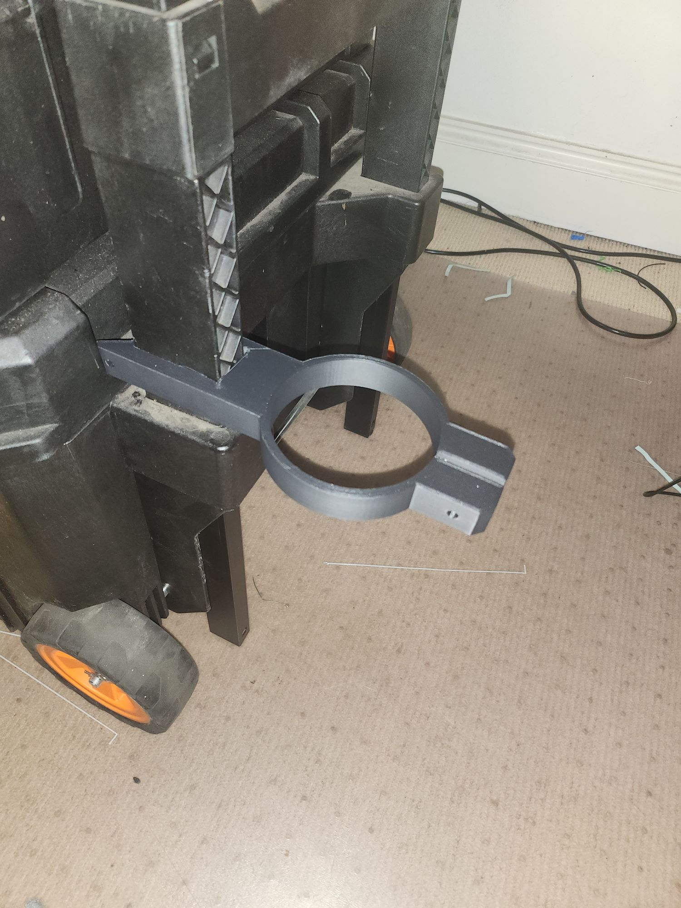
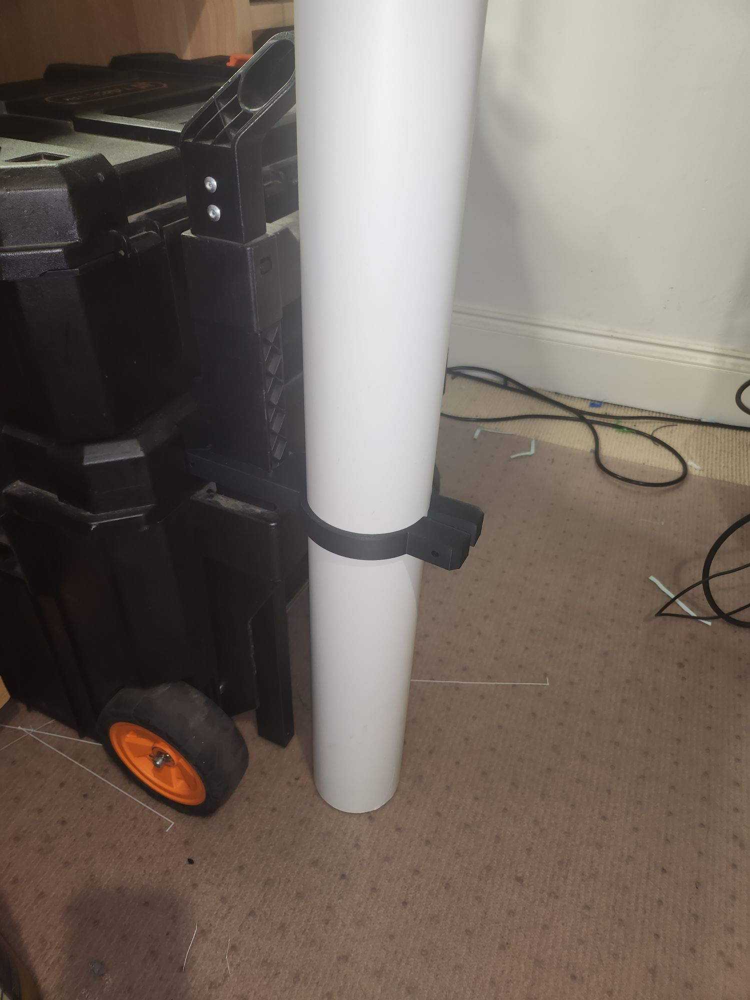

Whenever I truck into the makerspace with me trusty Tactix rolling tool box combo, I may still need juggle pesky extrusions and linear rod too long for even me basket that clicks on top.

So I did muse last time I was at the maker space, that I should add a 90mm PVC bracket to the toolbox so I can cart extrusion and linear rod in a tall "bucket".

And voila! I ran out of black so I have only printed one. I am toying with whether I want one or two PVC "buckets". You need two clamps in for each in any event. You can see the holes for the M5 bolts fo the clamps? You may only need the one for the pipe, as when I push fit the one in the photo (carefully) it clicked loudly into place as it was a perfect tight fit. If you have the pipe end clamped it will hold the two clamps apart. Still, there's M5 holes in the barbed clamp for the toolbox post. (I also notice the toolbox needs a dusting 8-).

A good snug fit around the 90mm pipe. I was going to glue the cap on the end but then I thought I'd get a screw fitting so it's easier to get the pipe in und out.

Cept the screw caps actually fit over top the tube, so that won't allow for pulling the tube out from the top.

So, I'll just 3D print an internal plug an glue that sucker in.

Yeah. So I am also planning on adding a couple of bicycle drink bottle holders from me water and coffee cup.

[STL file at thingiverse](https://www.thingiverse.com/thing:7264152).
