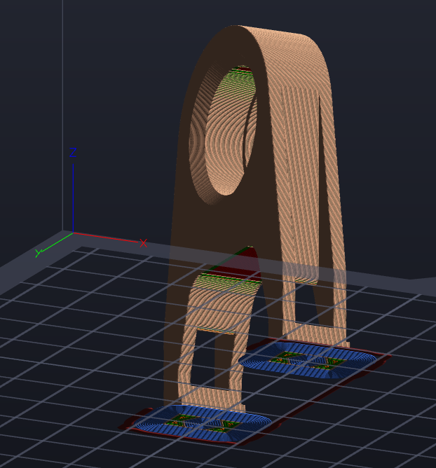

Found my next project (post Bear Build and Automatic corexy PnP build).

https://www.youtube.com/watch?v=x9rG15qrDIE

[Design Here](https://github.com/FreddieHong19/Open5x)

Don't forget [here](https://freddiehong.com/2022/02/28/open5x-accessible-5-axis-3d-printing-and-conformal-slicing/). Way in the future.

In the meantime, trying out printing of a [TrunnionPart5.stl](https://www.instructables.com/DIY-Desktop-5-axis-CNC-Mill/), being at Figure 1.

Figure 1

Why? I am wondering if it will print as setup. I have been becoming braver and braver with overhangs.
