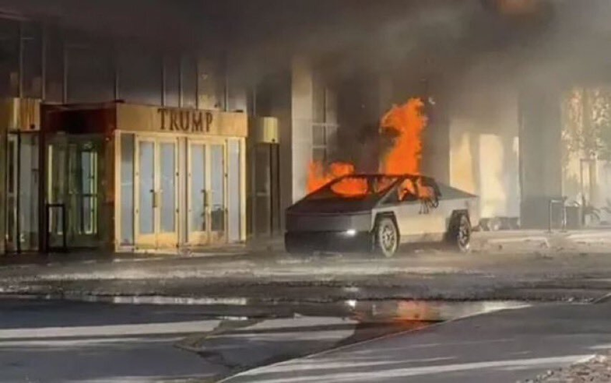

Musk says it was [probably](https://thenightly.com.au/world/usa/donald-trump-tesla-cybertruck-explodes-outside-hotel-in-las-vegas-killing-one-injuring-many-bystanders-c-17259681) terror.

Check the code on the vision system. It probably reads:

IF RED\_TOOP THEN ...

Like any software testing, the trick is to park a cyber truck at another Trump Tower, and see if it happens again.

Mwa, mwa, mwahahahaha!

So if it sounds far fetched, it [isn't](https://www.firstpost.com/tech/teslas-reaction-to-cybertruck-explosion-shows-ev-company-can-remotely-unlock-monitor-and-spy-on-its-evs-13849488.html/amp).

Even better evidence, there's now a fire [sale](https://carbuzz.com/jaguar-xk180-concept/).

Mwa, I say, mwahahahaha!

**UPDATE**

OH NO! Now Trump needs to look UP!

https://www.youtube.com/watch?v=vAmyOezZF6g&t=10s
