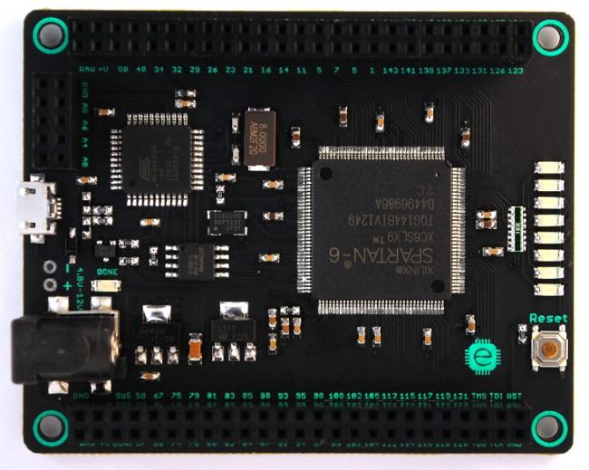
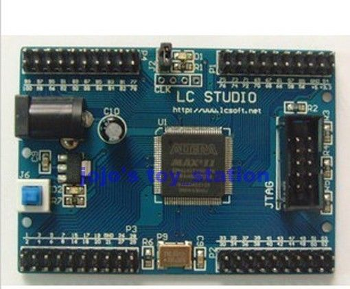

Exam in 5 days time.  Studying way too hard so brain exploding.
Decided to let my self wander the internet.
I had a flash back when I found an old site talking about using FORTH as a hardware compiler for PAL (Programmable Array Logic) (actually PALASM).
That took me back to when I actually wrote a PAL compiler in FORTH for a chipset I was playing with.  Had to, you know the old days, no free software so hobbyists had to make do.
So, I haven't played with programmable logic, or any hardware design, for a couple of years now so I thought it time to relearn.
Luckily for me (and you) now there is plenty of very sophisticated and free software for the new range of chips out there.
I came across a board for Xilinx Spartan 6 going half price ($35) because the designer felt the usb socket was too frail (nothing a little epoxy won't fix) so welcome to [Mojo V2](http://embeddedmicro.com/development-boards/mojo-v2.html "Hail Mojo")

And since I was at it I also got an entry level Altera Max II board for $10 just so as not to show any favoritism.

Flashing LED etc. for me to start.  I am partial to the idea of a FORTH processor in hardware (there are a couple of FPGA examples on web).
I also found some VHDL for inputting and processing video from a cheap CMOS camera.
So a full suite of not bad training potential.  Of course, plenty of PDF downloading already including a copy of the Blue Book (the apparent bible of programmable logic design).  Plenty of sites dedicated to hobbyist FPGA design as well.
Just have to get this exam over with.
