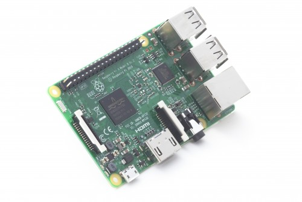
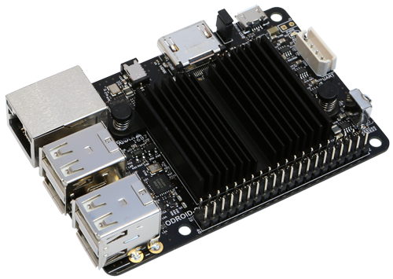

RaspberryDoodleDandyPoodle :- 64bit, 4 core, 1.2GHz, 1Gbyte memory, AUS$70!  Just the thing for a 12 year old bored skool kid to fry.

Odroid C2 :- 64bit, 4 core, 2GHz, 2GByte memory, AUS$70!
The built in bluetooth and wifi on the RaspberryDoodleDandy ... hmmm ... not enough.
Even the Odroid C0 makes more sense than the Raspberry OH NO!  Unless you want to turn on an LED whenever the local cocker spaniel cocks his spaniel on you mailbox ... nope not even then, got a drawer full of ESP8266 for that.
