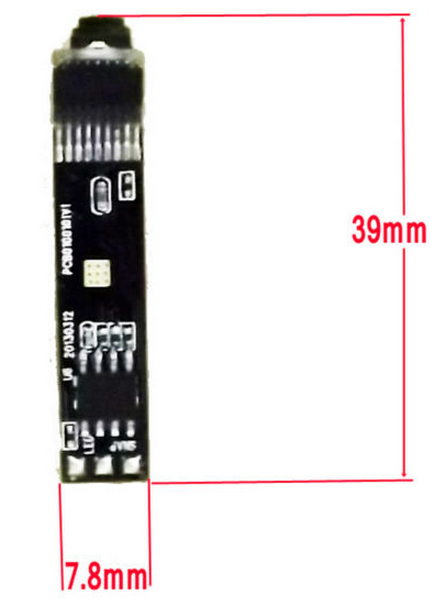
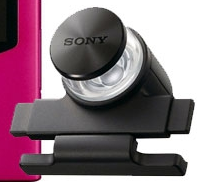
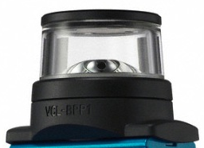

Endo camera modules on way:
[caption id="attachment\_1183" align="aligncenter" width="214"] This won't hurt a bit ;)[/caption]
To pair with the omni lens:
[caption id="attachment\_1182" align="aligncenter" width="203"] Perfect match for endo camera module.[/caption]
 
The [problem with the full unit](http://organicmonkeymotion.wordpress.com/2014/04/18/killing-time/ "Killing time") was 1) the glaring LED bathing the interior of the lens with unwanted light and 2) the tube the camera was in kept the camera aperture too far from lens ... so it didn't fit field of view.
The bigger difference between this and the lens from the older bloggy is that it is more of a periscope ... with a mirror at 45 degrees ... that the camera looks at.  The unit has a cover with jeweler's screws so might still take the mirror out and use camera co-axially with lens.
Won't know until the modules turn up to see how much of the field of view is filled.
In mean time, coding in the background to work a 360 degree collision detection - stealing from a few places.
Now that I am also getting a couple of older omni lenses:
[caption id="attachment\_1184" align="aligncenter" width="256"] Good for flat surfaces[/caption]
 
I will happily grind off the clip ends so I can hot glue or otherwise to [bottom of my Parrot as I planned](http://organicmonkeymotion.wordpress.com/2011/12/03/doh/ "DOH!!") some time ago now.
Post Script
[Here is price of closest alternative](http://eye-mirror.com/cart/index.php?route=product/product&path=60_62&product_id=70 "Bad enough having to by 2nd hand bloggy's to throw them out.").
