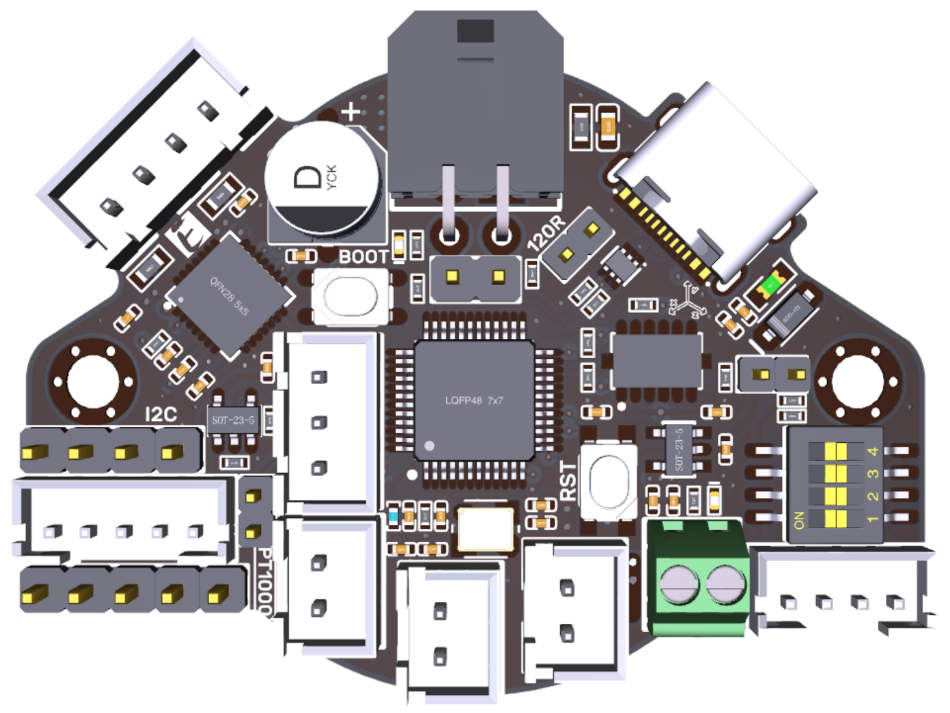

The automated PnP machine build is coming up in the intray.

I thought about it and it kept slipping because, in hindsight, basing the corexy mechanism on that from the [Voron Legacy](https://vorondesign.com/voron_legacy), because it looked neat (albiet intricate), was pie in the sky - so there was some trepidation in there around putting the thing together and getting it going.

I was spinning through AliExpress and found (so-called) Zero G Mercury One.1 upgrades for the Ender 5, in CNC'd aloo-min-um. I was tempted, but turns out the upgrade is out there, including the step file for the mods, so I am printing the parts on my spanking new Bambu Labs P1P (thanks Santa!). The Mercury One.1 design is tidier, much, MUCH, tidier.

So, ahead of the actual build, I am "upgrading" the automated PnP to use the corexy from the Zero G Mercury One.1 instead of the Voron Legacy.

That is somewhat of a seqway to the state of the Prusa Bear build. I took a pause to look at cable management options, since the thing is relatively messy with so many leads to route between the x-carriage and the controller. So, there was some trepidation sorting that out.

Then, I learned about toolheads. I sorta came across them when looking at the automatic PnP, and then on 3D printers.

There was actually also a position someone put that a BTT SKR PICO makes much more sense with a CANBUS toohead, so I did a little investigating. Turns out BTT does a [BTT EBB 36 CANBUS](https://github.com/bigtreetech/EBB/tree/master/EBB%20CAN%20V1.1%20and%20V1.2%20(STM32G0B1)/EBB36%20CAN%20V1.1%20and%20V1.2) thingy. So, it seems not to have fancy EMI widgetry on it, but it's cheap and fine I think to work into the design (I can worry about any EMI issue if it arises).

It turns out you can setup the [BTT SKR PICO with another build flag](https://github.com/rootiest/zippy_guides/blob/main/guides/pico_can.md), so why not, ...

