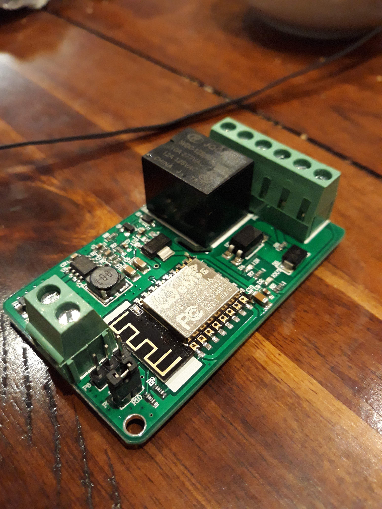

So, found some [info on the board](https://ucexperiment.wordpress.com/2016/12/18/yunshan-esp8266-250v-15a-acdc-network-wifi-relay-module/).
Where I thought there was dual throw relay, it's even better since the second set of terminals are a optocoupler. So, that would be grand for either of a rain gauge input, the audio trigger for dog barking, the flow rate sensor et cetera.
It is otherwise an WeMOS ESP-8266.
What is crazy is that the board thinks of everything and has bidirectional zeners on [power](https://www.diodes.com/products/discrete/protection-devices/zener-tvss/part/SMBJ33CA) and [optical](https://www.diodes.com/products/discrete/protection-devices/zener-tvss/part/SMBJ6.5CA) inputs so its really for light-industrial applications. That is, includes [Transient Voltage Suppressors](https://organicmonkeymotion.wordpress.com/2016/12/25/zippity-do-dah-zippity-zappp/).
AND! One of the terminals is a regulated 5V output! Just exactly enough for the [sound level detection](https://www.jaycar.com.au/arduino-compatible-microphone-sound-sensor-module/p/XC4438) for the dog barking.
Loving it!
