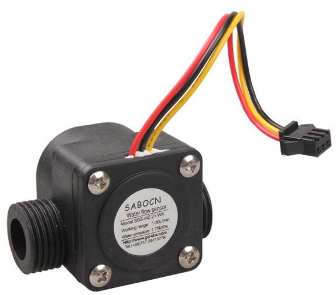

So, just got delivery of my 5 WeMOS uno clones ...
 

... and 5 ...

... we are now ready for OpenSprinklette!  All up AUS$11.00.  Only four channels but add a second unit for sum total of AUS$22.00!
So, a little work as we need to convert the 12volt AC to DC, should work a treat as the WeMOS board is happy to take 9-24V and also provides the 5V the relay board needs (apparently the 3.3V outputs should be okay \*whimper\*).
Now, since the "leak" (and the $3K water bill for the quarter) I will fit flow sensors to ensure flow is within expected range - so the unit can raise alarms.  Got 4 from Aliexpress for US$12 (or US$3 per sensor) which is better than the AUS$15 per sensor LittleBird is pinging people for similar devices.  Just needs a 3.3V zener and a 220 ohm resistor to adapt the 5V output of the sensor to the 3.3V inputs on the WeMOS.  Will build that onto a protoshield. (Anyone know what the connector type is from the photo below?)

The NodeMCU provides NTP so I can run timers on WeMOS.  MQTT to the ODROID-W server (in the house) to pick up the watering times, weather off internet to decide upon whether or not to water etc.
A second two will be used for remote control of back and front yard lighting.  So remote ON/OFF and IR triggered to boot.
 
