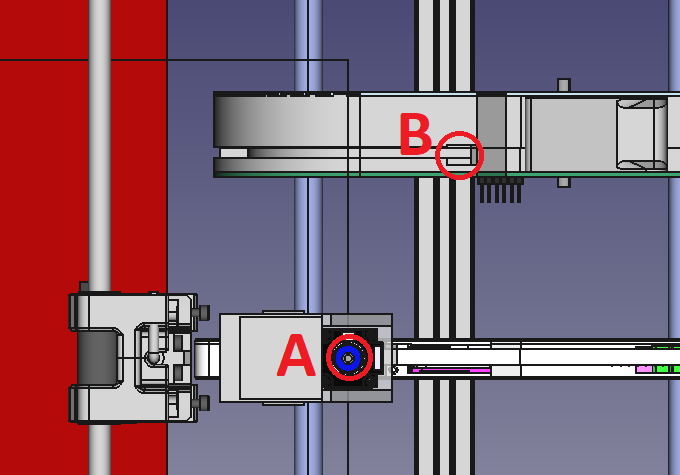
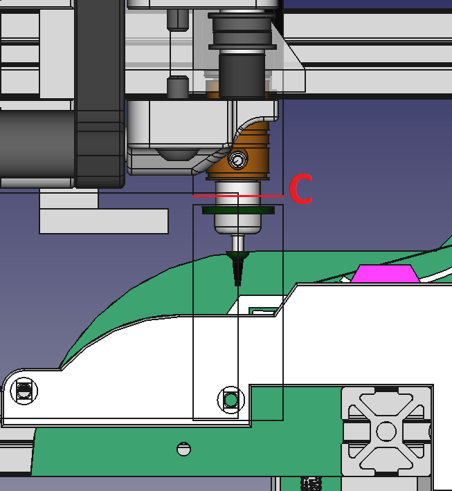
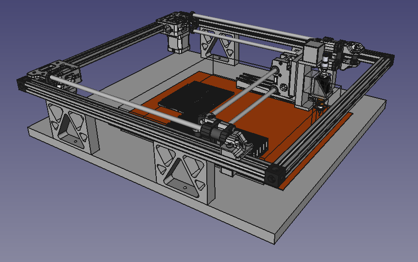

So, recapping, the options are endless.

Option 1 - Full cage

Note, on this full cage option, I chucked a feeder from the Index project for comparison. It really only needs the working bed re-arranged (the Index feeder needs to go in a tad deeper - see B in Figure 1). So, the final arrangement really relies on the feeder selected. Again, any Y-Axis given up with feeders can be compensated for by making the Y-Axis bigger.

Figure 1 - differences in depths of feeders

Z-Axis is fine, still within working boundary as per C in Figure 2.

Figure 2 - Still under Z-Axis Max

Option 2 - feed tape under raised PCB

Option 3 - No feeders but still have trays

Option 4 - with feeder, feeding spent tape down
