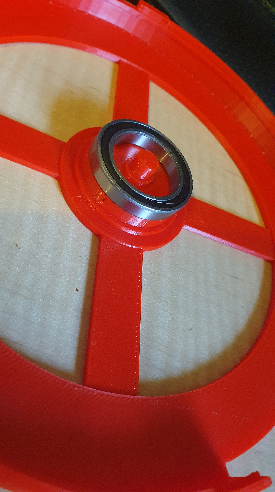

https://www.youtube.com/shorts/GR4RXfU7smk

A hack of the design by Unexpected Maker to fix a problem desribed in his video. Call mine above V4!

The post in the middle did not break off per se, there are fiddly aspects with tuning the settings for a Zortrax M300 and yelllow ABS it seems. The original attempt seemed to have a real problem with layer bonding, so I speed up the lava flow and slowed down the print speed. Mostly the print is beautiful, save for the dopey post. Some superglue will fix that.

https://www.youtube.com/watch?v=scHSrFdWn5k&t=584s

Details of initial rough draft in issue at [github](https://github.com/UnexpectedMaker/manual_pnp_turntable/issues/15).

Prototype up at [Thingiverse](https://www.thingiverse.com/thing:6310146).

This rotating pnp assembly tray being to go with my Hakko 394 vacuum pickup.

https://www.youtube.com/watch?v=q9AA8I2TsJs&t=0s

So here is the pesky problem I had to fix. The post for the bearing had been set to the outer but not the inner diameter of the bearing. Apparently this is only a problem in the OpenSCAD code somehow, since all the associated STL the author provides do not have the problem. There is a pull request, 2 odd years old, with a "fix" but I had "fixed" manually locally.

Also noting my fix need two variable name changes, so I cannot vouch for the change suggested in the pull request, which only changed one variable name. My code is up at Thingiverse (see "[Turntable.scad](https://www.thingiverse.com/thing:6310146/files)").
