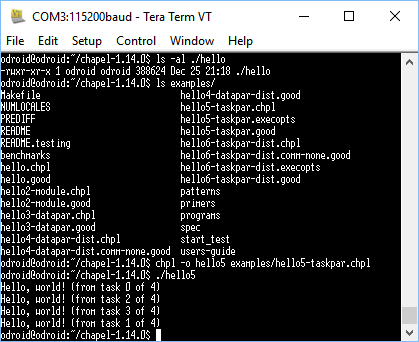

So, I fell upon [Chapel](http://chapel.cray.com/), a parallel programming language.  It makes sense for things that Erlang and Elixir are not good for - like image processing.
It isn't Google's,  it's actually Cray's.
So fun facts:

1. When working in Canada I came across a coffee mug in a second hand store that was from Cray.
2. You can [Cram a replica of a Cray into an FPGA](http://www.chrisfenton.com/homebrew-cray-1a/).

Now I have Erlang up and running on my ODRIOD-C1 home server.  I will get Elixir and Phoenix running as the wife will likely want something less geeky than node-red for her interface to the home automation.
In the meantime, for fun, Chapel is at this very moment compiling on the OD-C1.  Why not, quad core.  Apparently, for non-Cray etc. monsters, you simply need a  UDP module compiled, a lot of fiddling, and you can have two or more nodes (Locales) running.
In any event, the parallel helloworld found me four cores on me OD-C1.
[caption id="attachment\_3307" align="aligncenter" width="419"] Black Magic[/caption]
There was a configuration script to run but other than that I did not have to tell it how many cores, so some smarts buried does the job.  Otherwise the code to run the print on all four cores is a straight forward as:

```
config const numTasks = here.maxTaskPar;
coforall tid in 0..#numTasks do
   writeln("Hello, world! (from task " + tid + " of " + numTasks + ")");
```

There is also an [image processing tutorial](http://primordand.com/chapel_by_ex) using Chapel.
There are even [lecture notes](http://courses.cs.washington.edu/courses/csep524/13wi/) around.
