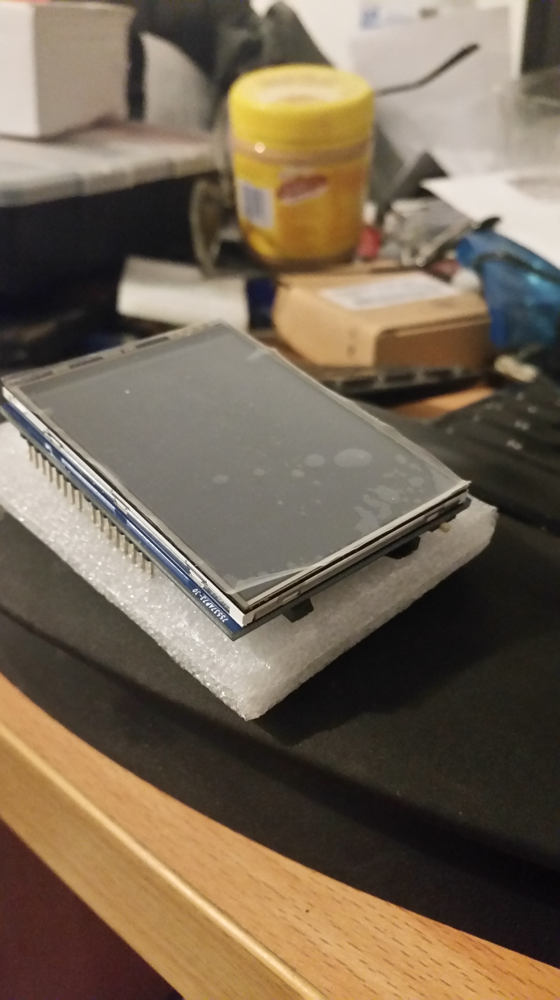

So, following up after a previous promise I got myself a cheap arduino touch screen that was on sale, to act as a Programmable Entry Panel or PEP.

I will use the Wemos D1 and the Arduino core fore same to try to port the associated library onto Wemos D1. That way I can have a control panel via MQTT.
Yes, there wiĺl be a Android version as my wife got herself a Samsung - though so hates it.
Saves me the hassle of working in iOS.
