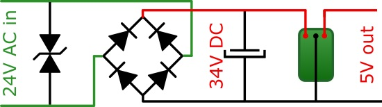

Lost my link for the basic circuit I have been using to convert 24VAC down to 5VDC when I cleared a folder of links to aquaponics.

Dug around and found it again.

For posterity its the following:

Simples!

Mitt the Pololu, really even a 3.3V, 5V or 9V DC step down regulator module, to down size from the 34VDC. [Details at the site](https://www.yoctopuce.com/EN/article/how-to-detect-leaks-in-an-irrigation-circuit) the circuit came from. The author has a nifty "boardless" assembly style.

For the quad relay board I am using [D24V3F9](https://www.pololu.com/product/2099) as this is 9VDC into the VIN of the Wemos D1 R2, which needs to be of the range 7-12VDC. Careful now, the Pololu people have a great sense of humour. None of their step down boards seems to have marking to allow distinguishing the 3.3V, 5V and 9V units apart so leave then in their little pouches until use. I got stung, trying to be organised, to stuff them in a parts box without their pouches. You can work out what the output voltage is of course, with a breadboard, a programable power supply and a multi-meter. But why?

Of course, I only bought one [D24V3F9](https://www.pololu.com/product/2099) originally, DOH! Parts box has plenty of 3.3V and 5V to pull out on a whim. So back ordered from Core Electronics. Littlebirdelectronics lists them but has nil stocks. Jaycar does not list these step-down regulators at all.

Sure, it might make sense to stop using the breakouts, but not unless I move things to a production run.

Opensprinklette V3.0, in design now, will break everything down to provide a simple 4 zone unit on a single board.

Because they are designed to be used as distributed nodes, 4 is enough since most home systems probably would get away with 4. Even if you wanted to go to 8, you might find having a second smaller unit saner - since you might have one in front yard and one in backyard and not one great honking unit.

I still like the idea of a single sprinkler unit small enough to bolt onto individual sprinkler solenoids. That way sprinklers can sit on a power buss. So, once I have downsized the quad to a single board, I will downsize to provide a bussible single relay unit.

If it helps I am using 5KE47CA as the TVS. I did buy 5KP40CA initially, as recommended from the designer of the circuit, but they are so large! The 5KE47CA has a reverse stand off of 40.20V rather than exactly the 40V of the 5KP40CA. The 5KP40CA wins on Peak Pulse Power Dissipation and Peak Forward Surge Current of course. But that's why the 5KP40CA is physically larger than the 5KE47CA. As this is for clicks on the powerlines due to relay switching rather than lightning strikes on the inputs I opted for the smaller physical device.

Moving onwards and upwards, I may be good with SMBJ40CA-E3/52 600W 40V bidirectional SMD TVS.
