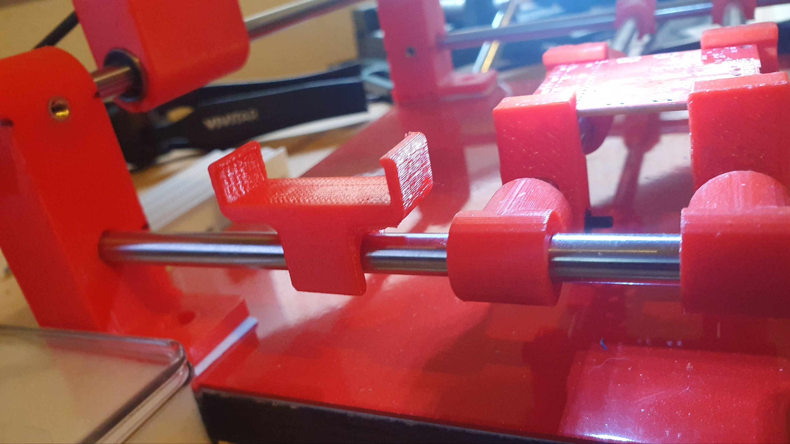
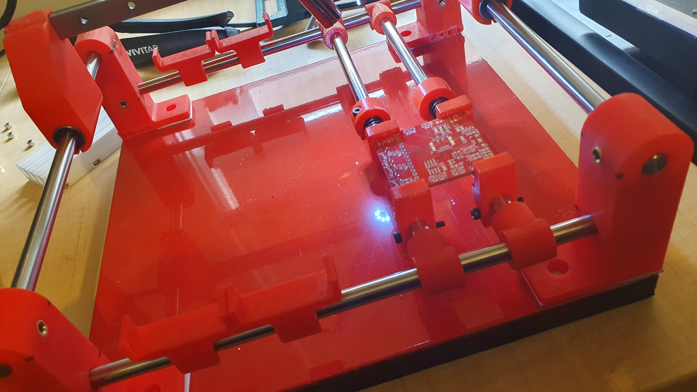

So, the problem with hacking together the smaller manual PnP is not thinking it through all the way.

Turned out, while the mild steel plate is a great idea for the magnetic SMT feeders, using the rod-based PCB holder meant my PnP nozzle was either going to have to work at the PBC level, or the base level. It can't, however, work at both.

Luckily, the pull through design has part tray holders for both the PCB and the rod-based options.

The metal plate would, however, hold up if you opted not to use the rod-based PCB holder. Seems, though, using the rod-based PCB holder, you likely don't need a base, as everything would "float" on the rods.

So, you could have two entirely different assembly options. They may also make sense as design options.

As I said, phew!

I just need a 300mm x 300mm build area on a 3D printer to print the 250mm long x 34mm wide trays.

Otherwise, a perfect fit, since I opted for a 250mm x 250mm base on this mini manual PnP. Gold!

So, the best I think I can do is, at most, dependant upon the PCB being worked, fit two parts trays. The arrangement above is with the limits of the x-carriage movement. In fact, the left most tray position currently assumes one might push SMD to a spot in the tray where the nozzle can pick them up. Otherwise, the two tray positions need to shift further right.
