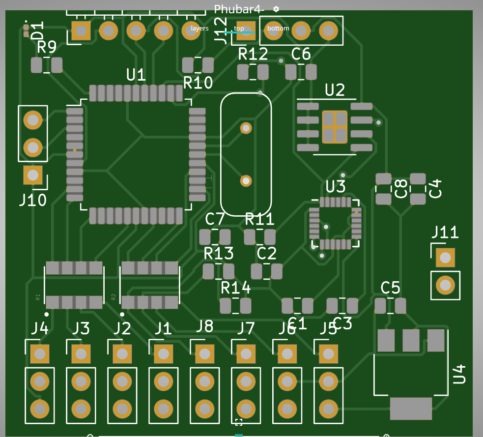

So, way back there was a hack using a Parallax Propeller chip called [Phubar](https://code.google.com/archive/p/phubar/).

Ostensibly a gyro for RC helicopters, but I thought it might be a good little fun hack project for small quadcopter.

Now its some distance from the [ELEV-8](https://www.generationrobots.com/en/401100-elev-8-quadcopter-uav-kit-parallax.html), but what if you wanted a small hack for ... hacking? Why not.

So, it had always occurred to me by beefing up the board by adding an MPU-9150.

The thing that made this task a dream was actually a discovery that there is a separate auto-router available (outside of KiCAD), that can suck in Specctra DSN (exportable from KiCAD). There are various red-herrings out there as to how to install a tool called Freerouting. Ignore them and go to this [link](https://github.com/freerouting/freerouting).

So, a little dabbling in KiCAD was in order. Starting with the schematic for Phubar 3, I scratched out a Phubar 4, with MPU-9150 (see U3 in image below). This is the first pass hack to work out the tool interoperability. So this is one run with the auto-router. Pretty neat! But you can't just dump chips and expect the thing to solve your problems. You need to input the design and generate a netlist. When the PCB is auto-populated you need take note of the messages the netlist is visually given you. Meaning, you need try "unwind" anywhere the netlist is "crossing the streams" in the tangled "rat's nest". This will take moving parts around and rotating them to try and reduce any tangled "rat's nest". Once you have untangled the "rat's nest" displayed over the PCB, then export it for auto-routing.

J1, the propplug port, is drawn off the board, a whoops which needs to be fixed. J12 is to provide a separate serial port from the programming port. J11 is the I2C aux from the MPU-9150, to allow chaining out the I2C port. J10 is the original extra port. Still playing with how many to add or take away.

The aim will be to now cramp it up a tad more, replace the original crystal with a SMD variant and also downsize connections and maybe sneak a circuit for a simple camera and camera Tx -- or not.

I might also just turn the optional external port J10 into a GPS port. There was promise of this from Phubar 3 but the code based it apparently turned up in is nowhere really to be found. Ah well, some more hacking to be had.
