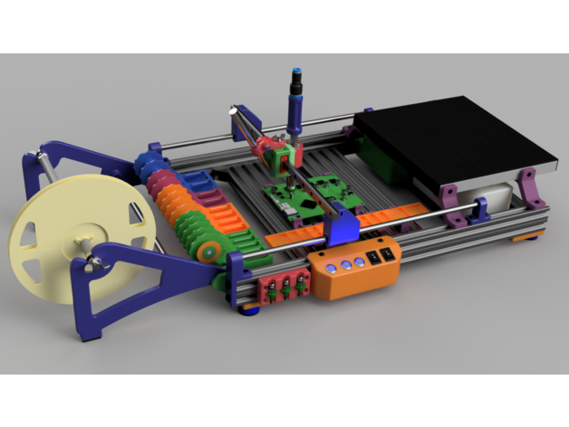
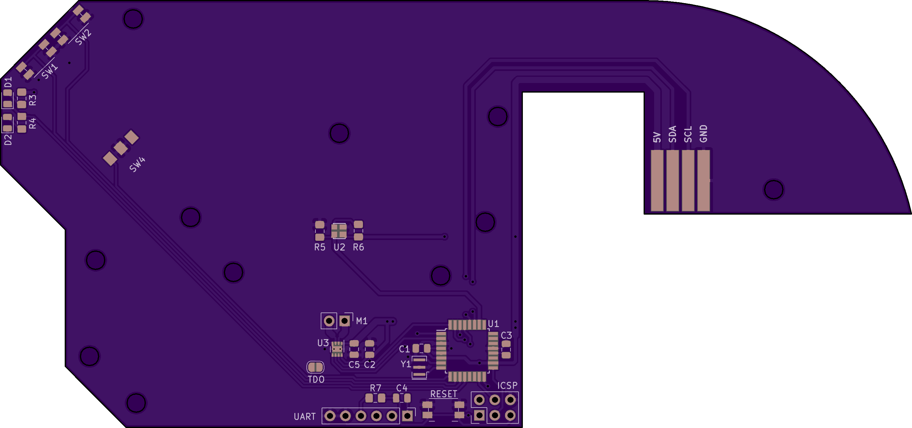
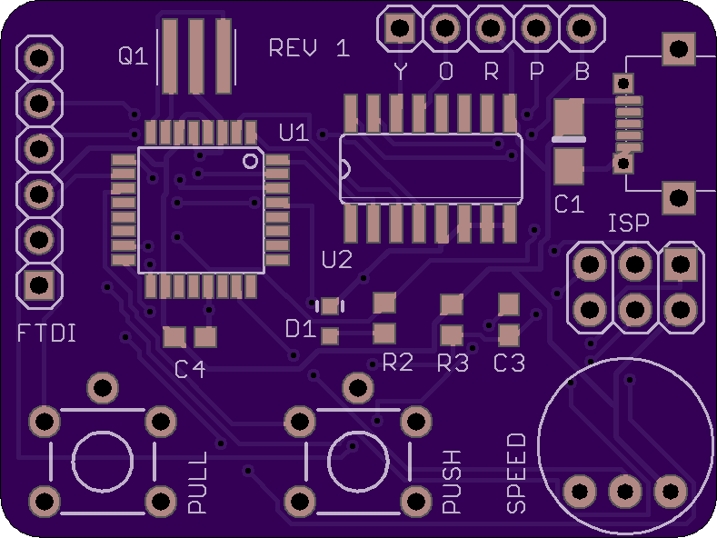

So, it occurred to me, watching videos of people hand placing smt devices with tweezers, that I might get the shitz up with the fiddling AND my eyes are not what they were. Still for very small jobs I have a USB microscope for the laptop.

So, I thought about a small pnp machine BUT did I want an automated one?

I thought about it and settled on a manual one by [lorinczroby](https://www.thingiverse.com/thing:3644398), which looks like this:

It will turn out relative expensive, but its probably the best complete DIY system I have come across. I have already ordered the aluminium extrusions and corners at AUD$117. All up around AUD$400. Scary because its got not electronics past those for managing the pneumatics - that is, no cnc. Prices on Aliexpress are also not what they were, though they still beat local prices.

I am also swapping from OSHPark to PCBWay, as the prototype prices at PCBWay are ridiculously low.

For example, when toying with the idea of the automated index pnp, by [Stephen Hawes](https://www.youtube.com/channel/UCMf49SMPnhxdLormhEpfyfg) ([great project by the way](https://github.com/sphawes/index)) , and using a version of the feeder thus:

Ignoring postage, OSHPark wants you to pay USD$81.40 (AUD$104.33 at time of writing) for 3 boards, or AUD$34.78 a board.

PCBWay seems to want you to pay USD$41 (AUD$52.55 at time of writing) for 5 boards, or AUD$10.51 a board.

If it helps, 5 boards from OSHPark would go for USD$135.68 (AUD$173.30 at time of writing ... WHAT!).

Though, whether PCBWay picks up on the shape and charges extra I guess is something I would need to discover. Noting, it wasn't apparent from Stephen's descriptions. Note also the pcb based index well turns up machined to shape, round, spoked and with teeth!

I also thought that I might try selling off the excess to see how I go about my little projects paying their own way - so I am buying enough parts to build all ten (5x [zapta](https://www.thingiverse.com/thing:1119914) and 5x [Pivovarsky](https://www.pcbway.com/project/shareproject/Solder_paste_dispenser.html)).

So, FYI, the zapta paste dispenser controller board is:

So USD$5 for 5 at PCBWay. Same board USD$9.30 for 3 at OSHPark.

Ignoring postage, USD$1.00 per board at PCBWay. USD$3.10 per board at OSHPark (or USD$15.50 for 5 boards). The same 3x factor.

Mind you, it seems once you move into 4 layers the prices may be more comparable.

To test out PCBWay I ordered 5 boards for the solder paste dispenser by [zapta](https://www.thingiverse.com/thing:1119914). It was USD$5 and change for 5 boards. I also ordered 5 boards for the solder paste dispenser of [Pivovarsky](https://www.pcbway.com/project/shareproject/Solder_paste_dispenser.html). Why? Well wasn't sure which one I would prefer, but it turns out the two both make sense as zapta's paste dispenser is for insertion into a manual PnP system (especially the manual PnP system of [lorinczroby](https://www.thingiverse.com/thing:3644398)) and Pivovarsky's dispenser is literally for using by hand.
