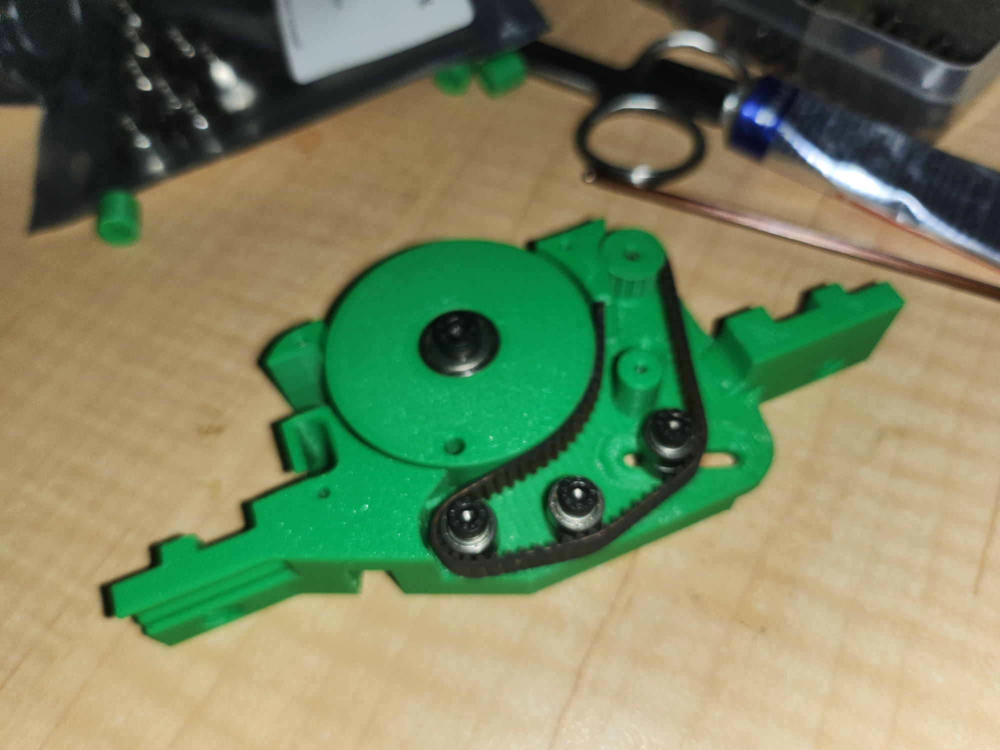
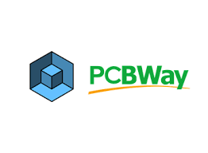

Porting of pick-plaz over to ESP32 on its way.

Bearings and DRV8833PWPR chips have turned up. I've just ordered DVR8833 breakouts for prototyping the code.

I have an arduino based port for the ESP32 C3 Supermini and am working on a FreeRTOS version. Both need wait until my ESP32 C3 Supermini's turn up.

Still waiting on motor.

The board will still have buttons for manual control. Four not 5 LED (due to limits on ESP32 C3 Supermini).

Still early prototyping so hold your horses etc.

I am playing with pio console and using opencode/openspec to try to work out a workflow.

In the meantime I am trying to setup the espressif port of qemu in the vain hope it supports the ESP32 C3 supermini.

It'll be stop and start I'm afraid as its Christmas Eve so I probably should be doing other things, ho ho ho, bar humbug.

