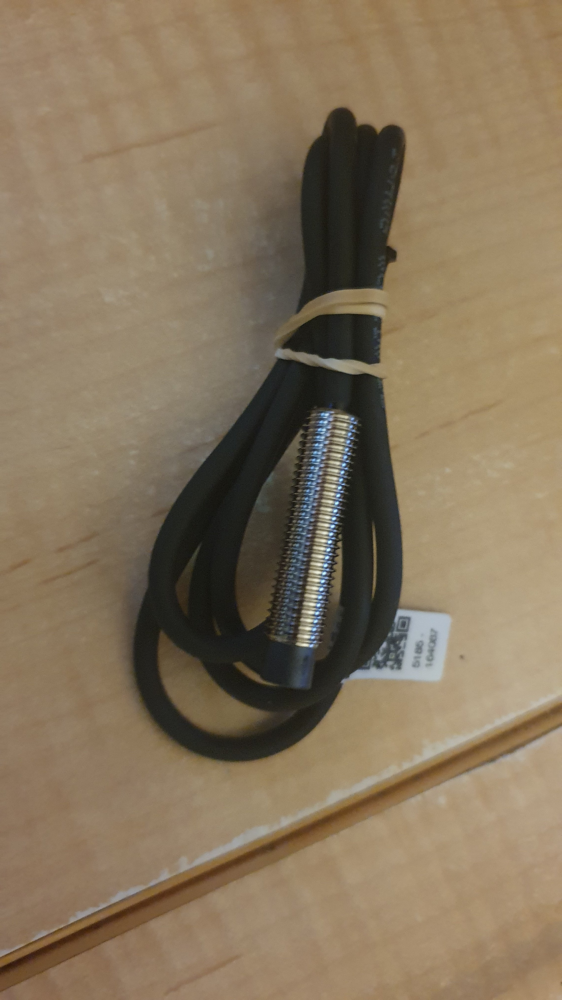
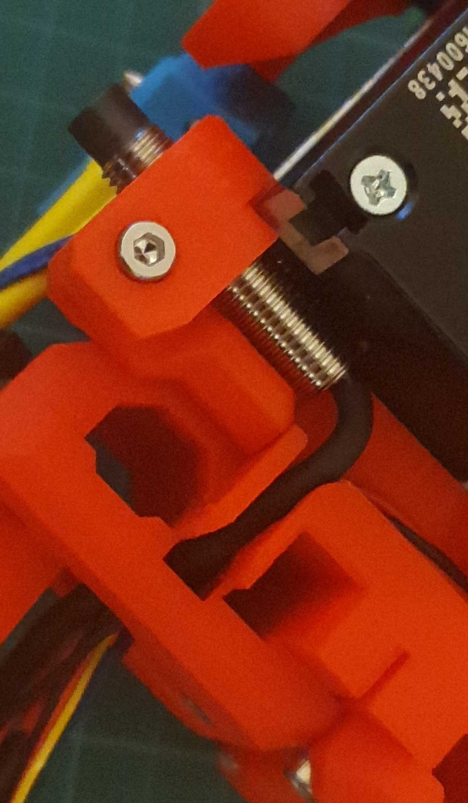
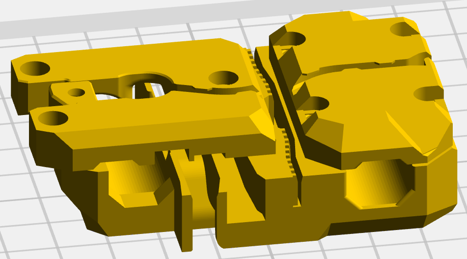
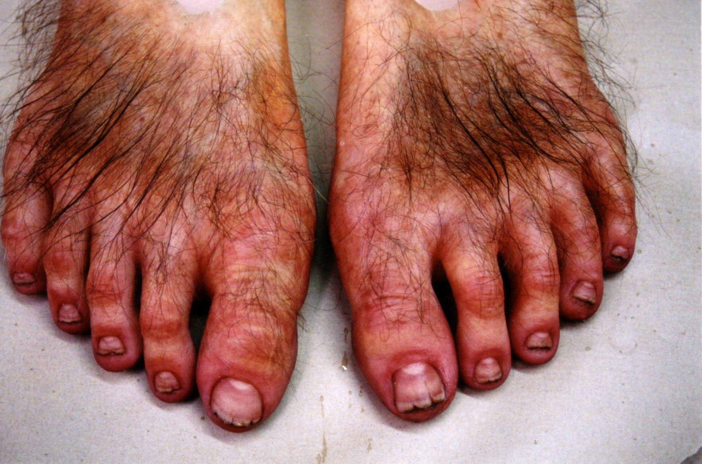
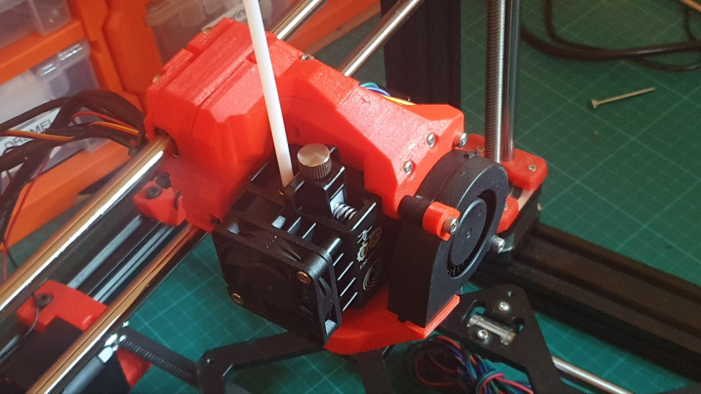
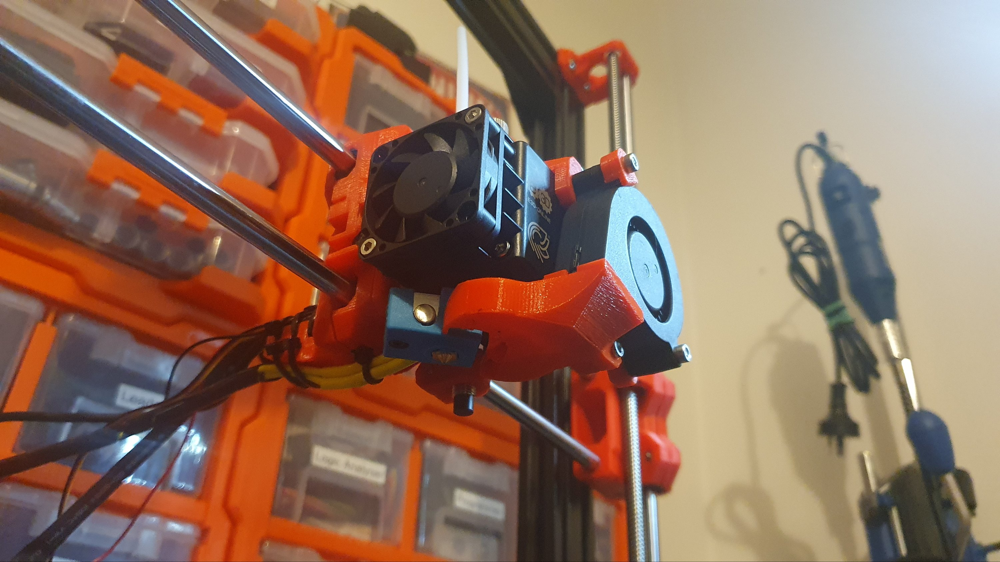
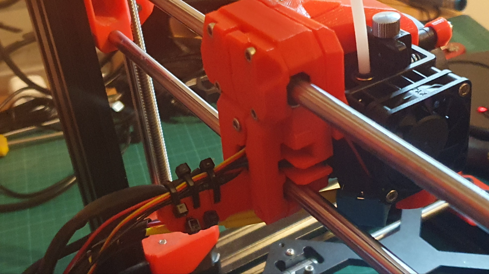

Ready for final sprint to install x-carriage.

Super PINDA

So, I got (of course) a Super PINDA. No need for temperature calibration.

Tidy!

The design of the [Hemera x-carriage, BRILLIANT](https://github.com/gregsaun/bear_extruder_and_x_axis)! I mean, have a look at the front and back pieces of the carriage in the figure below. You can see the thoughtfulness in the design. I have lined one piece up with its final position. The other is shifted so you can see where the toothed belt is inserted. You can therefore see that you can mount the x-carriage, and set up the belt, without problems of keeping x-carriage mounted.

Thanks Grégoire Saunier! Great design! You have KNOCKED MY SOCKS OFF!

Knocking Socks of,

Grégoire Saunier!

Get the Hemera x-carriage files from the git repository, navigate down to:

`bear_extruder_and_x_axis/optional_parts/bear_hemera/`

I need to research the next step, the wiring up. I will need also to script out the time lapse of the build.

What? Yes? I haven't added the belt, yet. As I said, thanks to Grégoire's design, you can install and then admire.

