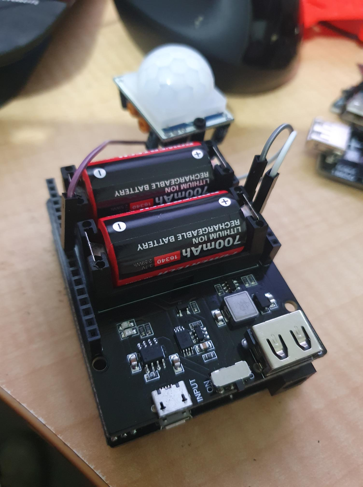

Knocked together a temporary wifi PIR sensor.

So, with fencing contractor turning up for a 3 day task of replacing the side and back fence on our property, I thought I would throw together a couple of motion detectors to keep an "eye" on the backyard at night.

The plan was to use a couple of WEMOS D2 R2 2.1 I have. Along with dual 16340 battery shields and also a side-dish of HC-SR501 PIR Sensors, a wifi based motion detector is born.

I did hack this into my [opensprinklette](https://organicmonkeymotion.wordpress.com/category/opensprinklette/) system, adding the PIR as "gadgets".

I have a node-red setup with text-to-speech, and a ping to my MQTT server provides and audible warning. It also sends an email to my personal account. I would have sent an SMS to my phone, as I have a second phone with an old SMS server on it (no need for external accounts). Just cannot find where I put that phone (DOH!). In any event, works a treat with vanilla code.

The problem is I have tried getting the light-sleep mode working to try to get as much oomph out of the batteries (to cover off most of the night). BUT. But, it seems the wake function is not so reliable. I can get it to wake not long after it sleeps, a couple to three times but, with a light-sleep function, it seems to work for a couple of times - then naught, stays asleep.

I have a LWT set up so the WIFI on the board is getting turned off (since the LWT is reported by the MQTT server). With a little too strenuous waving you can get thang to reconnect to the WIFI and report movement at least once, maybe half a dozen times, buth then goes to sleep and never wakes (or really I am not going to wait for the very long and boring timeout that has been set).

I note the example code loves GIO02 (which is the BUILTIN\_LED on the D1 R2). I have also tried various other GIO, assuming it may be problematic on some IO and not on others. There is a warning not to use GIO16, which I heeded.

Without a sleep function, I the thang can tick over and ping the node-red flow I have set up reliably, with no obvious problem with false alerts. So I relented and went with that.

I have decided to set it up to run all night on my desk, facing away from seductive heat signatures. I have a "herald" message, and I assume the battery will die into the night, so I'll see a LWT. That way I can gauge how long an approach that does not use any sleep mode will provide movement detections.

Speaking about opensprinklette, I am half way through designing a cleaner board. But then found a not bad board on Aliexpress. The (take a deep breath if you're going to say it) [LILYGO® T-Relay ESP32 5V Relay Module 8 Channel With Optocoupler Isolation](https://www.aliexpress.com/item/1005004347564200.html) (if you're turning blue ... I told you so!).

I might have a look at a port of opensprinklette to that board, though it would need a separate 24VAC to board DC conversion.

UPDATE

Ran the simplified code all night. Only reading the PIR and then sending an email if high. Ran for about 4.5 hours, which was probably okay for the job - it really only had to work for one or two nights. So, with a recharge in between and a half the night covered, goodenuff.

The problem, and as many people are reporting for this PIR, quite regular false detects. False since I had it running on my desk, in the dark, facing the back panel of a bookcase. So darkened room. No movement. In the morro, chockablock my email was with "Boo! Movement detected" messages sent from node-red.

The "missing" false alarms when running initial tests appears simply because the false alerts were intermittent, and the initial bench tests were short runs.

I thus dropped the ESP8266 based approach for an ESP32 based, as the ESP32 SDK seemed simpler to sort. However, two problems. One, the WEMOSBAT board seemed not to charge the battery (I have one on my [Manual PnP for a wireless peddle that seems fine](https://organicmonkeymotion.wordpress.com/2022/09/03/wifi-pedal-for-manual-pnps/)). The other, I can happily get the dang thing to sleep, but never wakes, though that may be the problem with the board charging or the 5v circuit.

Fence is up now, no need to proceed, BUT I will try another WEMOSBAT board to see if I've got a dud board or a dud battery.
