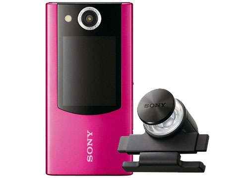
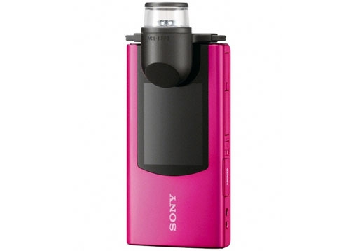

[It finally got here!](http://organicmonkeymotion.wordpress.com/2013/09/12/pixy-post/ "pixy post")
So, another distraction from my studies. Though the main culprit is I went looking for a second hand bloggie to get hold of a couple of extra omni-lenses.  They retail on the Sony site for $35 but you can't get them any more for the bloggie I have and the lens themselves were retailing $120 for spares when they did have them.
So, turns out you can get a second hand bloggie for $60 so you get a lens and a camera. I'll sell on the cameras to get some money back.
I am waiting on a response from sellers of two bloggie with the older setup - which is good since you can easily modify the lens to sit over a flat surface.
[caption id="attachment\_1131" align="aligncenter" width="450"] Good for flat surfaces.[/caption]
 
But I did get a deal on a Bloggie Duo that has a lens that is more like a periscope.

[caption id="attachment\_1133" align="aligncenter" width="450"] Give me one ping![/caption]
 
At the moment I am thinking of mounting the lens on a small plastic box and just us a USB catheter camera (raw camera for sub $20 from China).  Using the example [processing code](http://organicmonkeymotion.wordpress.com/2011/12/03/doh/ "DOH!!") (re-coded either in ADK or NDK for Android, or at least on Beaglebone for fun) and knocking it up so it can provide basic collision detection.
