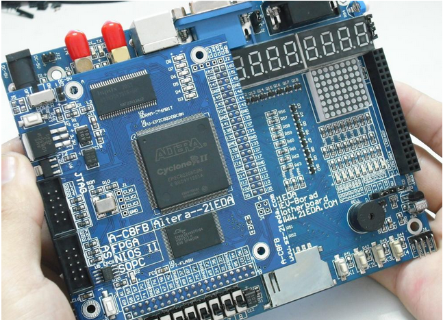

[caption id="attachment\_1202" align="aligncenter" width="450"] Bigger is better[/caption]
May have to upgrade my Cyclone experiment board.  For twice the price you get VGA output, stepper motor control, A/D and D/A, Infrared control, I2C, etc.
Oh, and RAM.
Makes sense for vision experiments and I tracked down a realtime hardware mandelbrot generator no less.
The board I am currently using though should do for the time being while I learn the basics.  Should do for frequency meter, maybe a [laser range finder](http://www.seattlerobotics.org/encoder/200110/vision.htm "May have to have serial output") - although that needs a blinking RAM bank DOH!
