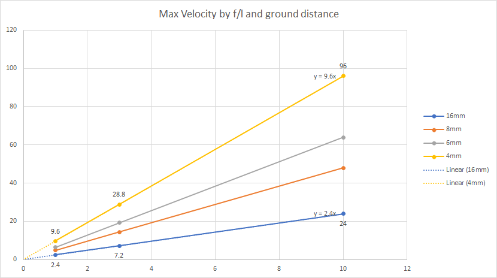
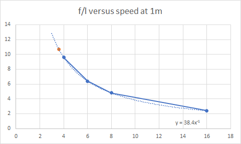

... probably as the technology has waned.
Still.
I bought a [PIX4Flow](https://pixhawk.org/modules/px4flow) for dirt cheap as the problem with encoders on the rock crawler is that the wheels spin or are off ground (dependant upon pose) etc. so something trickier needs be done with the odometry.
The problem with [mouse sensors](http://ardupilot.org/copter/docs/common-mouse-based-optical-flow-sensor-adns3080.html) is that they are only good well lit environments and cannot be used closer than 30cm to the surface - apart from other quirks.
The problem for the PIX4Flow, however, is the following velocity over ground by focal length of camera by ground distance.

| Ground Distance | 1m | 3m | 10m |
| --- | --- | --- | --- |
| 16mm | 2.4m/s | 7.2m/s | 24m/s |
| 8mm | 4.8m/s | 14.4m/s | 48m/s |
| 6mm | 6.4m/s | 19.2m/s | 64m/s |
| 4mm | 9.6m/s | 28.8m/s | 96m/s |

The PIX4Flow, of course, comes with a 16mm f/l lens so a maximum speed with a ground distance of 1m is 2.4m/s which is 8.6km/h (think jogging as opposed to [walking at around 5km/h](https://en.wikipedia.org/wiki/Walking)).
That's okay for a rock crawler except for the 1m story.
Now, I was [bamboozled by the equation for calculating the max velocity](https://pixhawk.org/modules/px4flow#optics) (since it seemed unkempt in it's use of precedence).
So a simple plot shows how the problem pans out.

So, if I use the 16mm f/l, at say 200mm, my max velocity would be 2.4x with x = 0.2m so 0.48m/s (or ~1.7km/h) which is roughly a 3rd of a average walking pace of 5km/h.
Of course I ordered a 3.6mm f/l lens from Aliexpress for $5.
The 3.6mm f/l (approximating to 4mm) would be 9.6x or 1.92m/s or 6.9 km/h at 0.2m (a brisk walking speed).  Presumably, it would be slightly better than than as, from the graph, the curve for the 3.6mm f/l would be slightly steeper than the curve for the 4mm f/l.

So, a quick plot of the 1m column (which coincidently provides the slope of the lines in the previous graph) and then best fitting the graph with a power based curve (extended by one unit) and we can estimate the slope of the 3.6mm f/l curve to be 10.7.  That should approximately be 2.1m/s maximum velocity or a healthy 7.7km/h.
Again, fine for a rock crawler ... assuming the $5 lens turns up, is what it says it was on the add, et cetera.
Fingers crossed.
Of course there are algorithms out there for slipping, sliding and drift using EKF.
 
