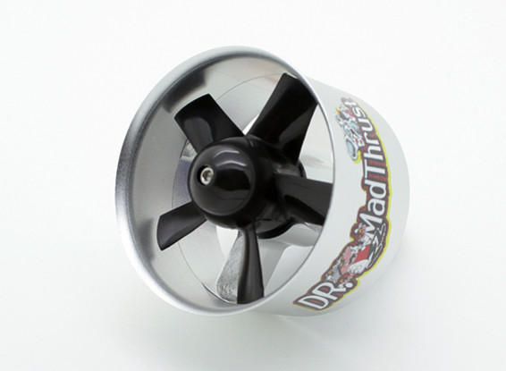
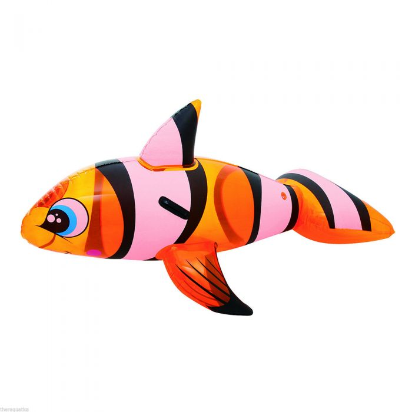
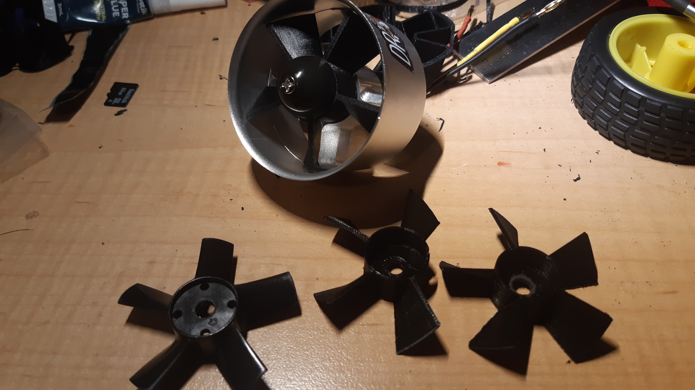
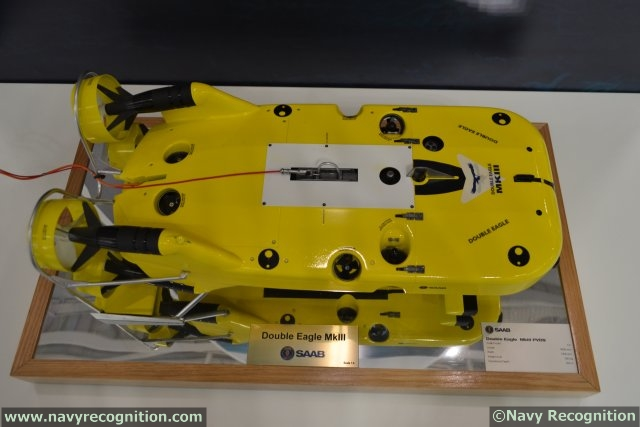
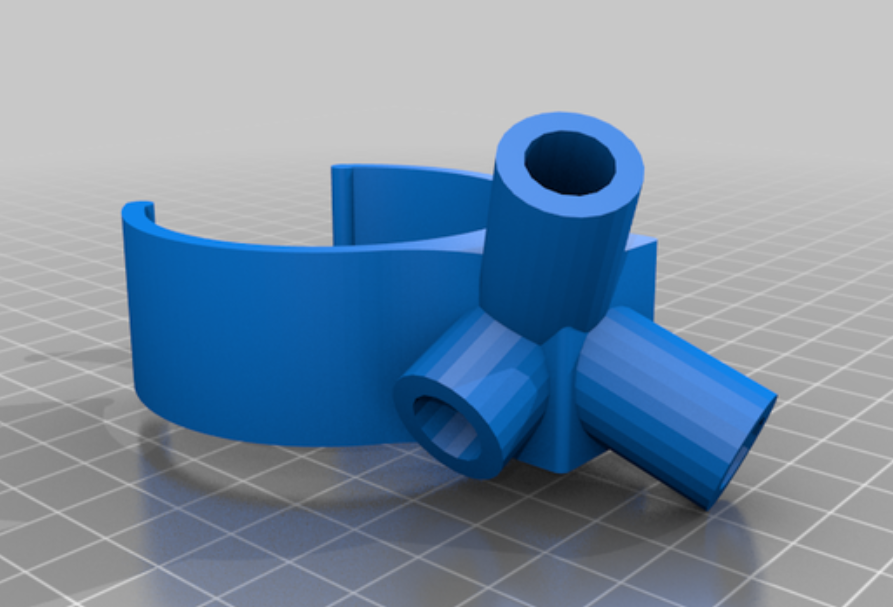

So I bought me 6 of these 50mm EDF some time ago. Should have waited, of course, since I really needed 2x3 each of CW and CCW units for my blimp project (based on a pool toy LOL).

The problem then how do I sort out the need for contra rotation to try to balance torque forces?

3D printing fans was the solution!

The bottom left fan is the original. The two on the right tests. The original [code for the fans was provided by someone else](https://github.com/hyperair/fan-blades). Note I did have to modify the code a little, since the source code had some design features that were not needed and also I had to add a disc with hole for the hub attached to the motor. You can see one test with a blade broken off? That was interesting, there appears to be a print phenomenon when the hug wall is too thin and the print does not weld the blades to the hub. Increase the hub thickness and the problem corrects itself.

To get CW and CWW I could run the OpenSCAD software twice BUT you can also mirror the STL file in the Flashforge software.

The problem might be that to be truly reversible, the thread on the hub for the nut should be in the opposite twist, since you always want your rotations tightening the nut. The fit of the printed hub is, however, quite snug and a dab of epoxy would aid and abet the retaining of the nut I suspect.

I was going to start with drive motors in the same config as for the SAAB Double Eagle. These appear aligned so there centre lines meet aft somewheres. For cruising rather than for fine manoeuvring per se. They make a lot of sense, since the lever arm with respect to the CoG is increased from where it would be, if the motors were lined up on the main axes. This then amplifies the turning force of the thrusters, so they can steer with greater effect. Or so I surmise. I haven't found a paper explaining the configuration ... yet.

So, I will use 10mm OD carbon fibre tube to build a frame to attach to Nemo (ROFLMAO) and here is the stl.

