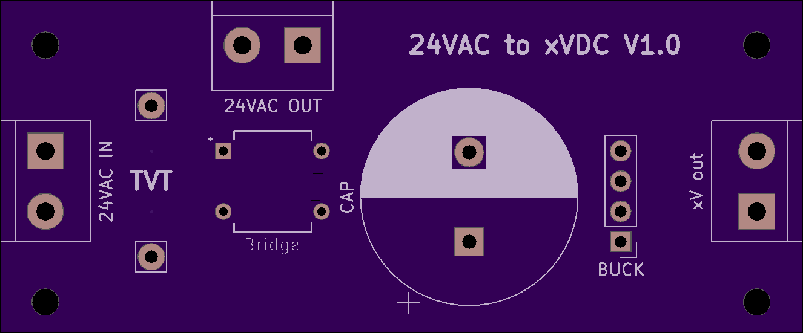
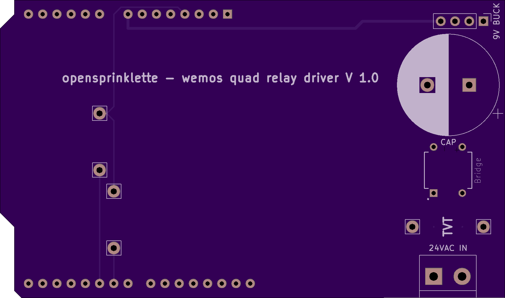
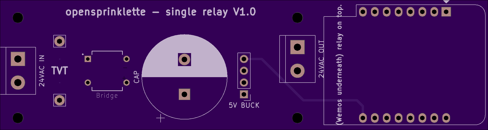

The problem for powering the modules, used for opensprinklette, is that the sprinkler solenoids are driven by 24VAC.

So, I have found a circuit idea to sort that, added a few twists and now I have three prototypes:

1. A basic board with TVS, bridge, electrolytic cap and Pololu Step-Down Voltage Regulator. I am using Pololu four pin step-down modules and the idea is you use a 3.3V, 5V or 9V depending on how you power up your board. (Yep, after buzzing out the prototypes I will correct TVT to TVS :) )
2. An Arduino UNO shield, with the 24VAC to 9VDC to drive the VIN pin on the UNO headers.
3. A Wemos D1 Mini shield to with the 24VAC to 5VDC to drive the 5V pin on the headers.

I will buzz the boards out once they turn up. I will get the software into github for the Wemos boards. I am still testing the node-red scheduling stuff as I am trying to get a scheduling option up that doesn't need to connect to a google calendar as well.

I have also come across hass.io and home-assistant so I will also look at that option.

In the meantime, I am doing a kotlin and kotlin + android course to get up to speed to write an android app to work with the system as well.

