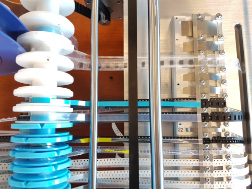
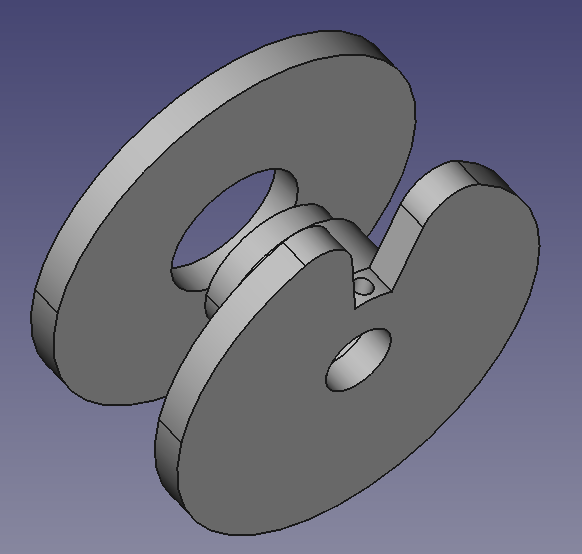
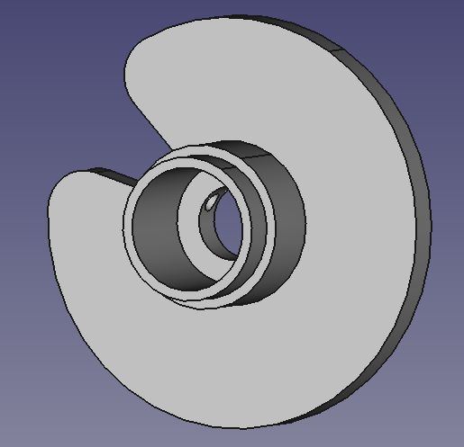
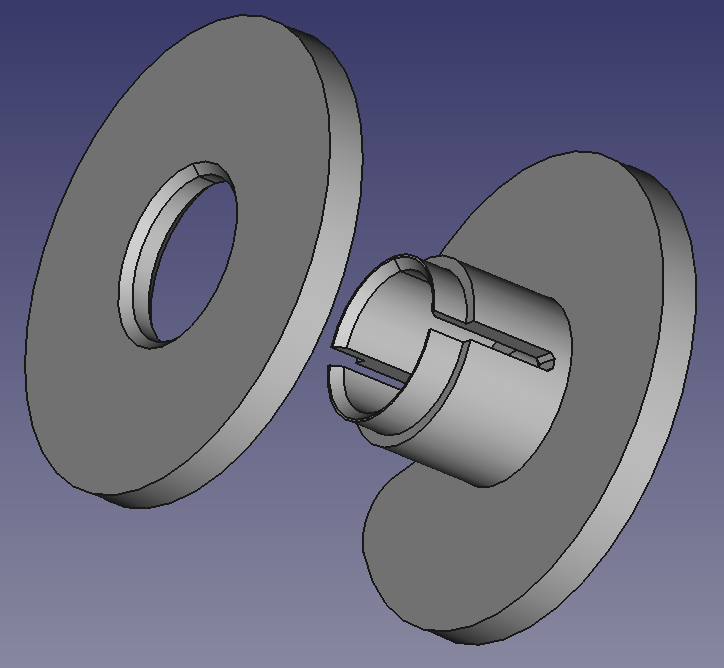

So, I kept seeing a style of SMT cover tape collector (see blue and white spools on the left in Figure 1).

Figure 1

It bugged me that there is no real name for that style of setup, or at least anything you can search on to find info on how they work - so as to allow a diy copy.

Then I lucked into a photo off the Net at Figure 2.

Figure 2

So, it seems they use a slip brake, which makes sense. That uses the grub screw against the shaft so that it grabs enough to pull loose cover tape onto the spool, but slips if it's under tension. So a M2 heat set for that solves one problem (Figure 3).

Figure 3

I also opted to not fiddle and use nylon LM8SUU or LM8UU, inserted to leave the grip/slip to the adjustment of the grub screw (Figure 4). That is, not have to struggle with tuning the prints to fit snug but loose on the 8mm linear shaft.

Figure 4

I have a pulley and NEMA 14 on the way. I just have to do a little more modelling to design the supports. I may opt to build this for [mini 100mm reels](https://www.compuphase.com/electronics/minireel.htm). [Draft spools at Thingiverse](https://www.thingiverse.com/thing:5136524).

Still playing with the design as in Figure 5. There will be 8mm, 12mm, 16mm and 24mm variants of course (12mm variant in Figure 5).

Figure 5

I will probably opt for a C-clip to hold the tail of the SMT cover tap onto the spool, to save fiddling with have to stick it to the spool.
