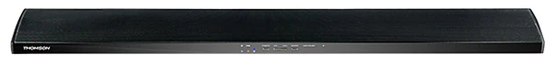

So Target had finally dropped prices of sound bars with aux input to AUS$49 so I can deal with the wife's nagging about the BOSE wifi sound system with a $9 C.H.I.P. and a $49 sound bar.
Voila!

Perfect for the bedhead in the main bedroom and the window sill in the guest bedroom or in the book case in the wife's study.
I only bought two as we had the speaker tower in the backroom.
Now, given all the problems I had with Armbian.com debian server distro and the OPiZ, here I am using nmcli to setup the static IP for the wifi on the C.H.I.P. with no problems.
Given I had the 3-pin serial cable out, I just swapped it over to the C.H.I.P. from the OPiZ.
I flashed with the headless server version 4.4 of for the C.H.I.P..
I used nmcli to setup the wifi using the [provided example](https://docs.getchip.com/chip.html#connecting-c-h-i-p-to-wi-fi-with-nmcli).
I then used "sudo nmtui" and setup the static ip and then reboot.
I found the device on my gateway list of wifi devices ... bute!
To install [shairpoint-sync](https://github.com/mikebrady/shairport-sync) I simply followed the instructions at [Hackster](https://www.hackster.io/11798/c-h-i-p-play-speakers-7cebb9).
The trick is where the instruction asks for interpolation to be set to soxr I reset it back to basic.  I also set the alsa property:
audio\_backend\_buffer\_desired\_length\_in\_seconds = 0.5 (it was set to 0.15).
I did this because the audio would drop out briefly.  Evidence is the soxr interpolation takes a grunting cpu and there might have been some network problems.  So, between relaxing the interpolation and buffering more audio, the dropping of audio apparently has ceased - much to Madam's delight.
The nuisance, the wife has given up her iPhone for a Samsung S8 - which she doesn't like.
I found you can get Airplay running on Android so we could get by.  I bought her a new laptop but she hasn't moved her iTunes to that yet.
She hasn't installed iTunes on the PC that I built her.  iTunes is on her old laptop so there are some politics there to get that transferred - especially as I have my eye on her old laptop to be my 64bit Debian dev box.
So while the Airplay route is "comfortable" it is rather "complicated".
However, she has an iPad that she now hardly if ever uses so it can be the server for the house music.
Too easy drill sergeant!
Too easy, that is, because even though I am using a debian based distro on the C.H.I.P., and essentially using the same tools to set up the C.H.I.P. as I was the OPiZ, I am having no problems with C.H.I.P. headless server.
What?
Oh ... yes, if she asks BOSE was bought out by Thompson.
 
 
