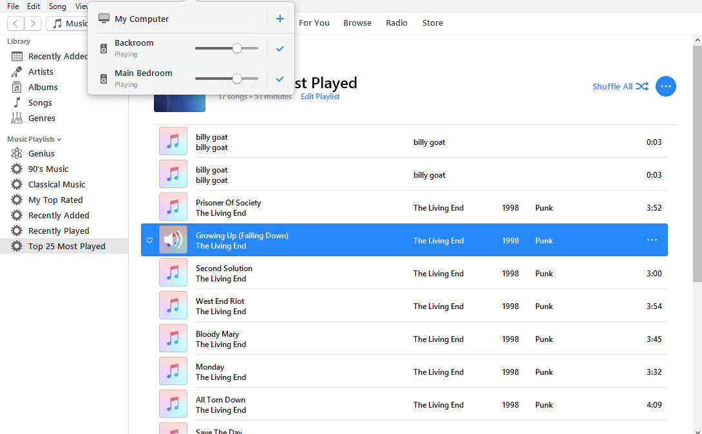

So, the joke I had with Mike Brady, the chap who maintains shairport-sync, was that the problem I was having with dropping of audio was that I was listening to my wife's punk music.
The acid test for the fix I have used (basic interpolation and longer background buffer) was to pump The Living End to two of the C.H.I.P.
Voila!

Of course, Madam was too consumed by her Sunday afternoon sitting of Criminal Minds to appreciate the success ... so she told me to turn off the Backroom link.
So, the one for her office is ready, just needs some fiddling to fit the speaker on top of the storage cabinet.
I am now looking at setting up one in the gazebo in the backyard and one under the veranda in the front yard (we have a pool area in the front).
