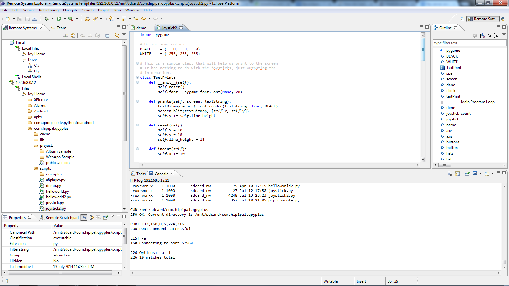

[caption id="attachment\_1468" align="aligncenter" width="450"] Gotta love open source ... sometimes[/caption]
So, I pulled together PyDev and a mystical FTP plugin (from general tools under Indego) to get access to my Android devices when writing QPython code.  I tried a couple of FTP servers on Android (including the neat FTP server that comes with QPython) but there was a road block.
The default port for FTP appears to be 21 and the Eclipse FTP plugin doesn't let you change this.
The FTP server built into QPython will let you set the port to 21 (it defaults to 2121) but it won't start.  Android won't let you run ports below a certain level without root permission.
A couple of other FTP servers I downloaded had the same problem until I came across FTPDroid which allows use of port 21 if you have root access - which comes with by JXD S7800B and I have also rooted my old Galaxy Samsung SII, so all good.
Additionally, I had a little problem (sorted by QPython authors) with missing modules that stopped installing SPADE into QPython but that all appears good as I had a couple of agents running on the JXD S7800B with the server on my PC.  So, code above is me hacking SPADE agents on an Android device running QPython.
