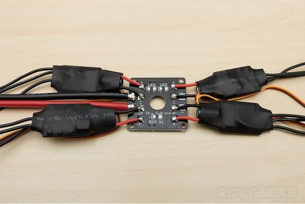

Go figure, no real instructions on wiring the thing up.  Yes you have to swap wires on your ESC for CW/CCW motors.  Silver (CCW) straight, black (CW) swapped.  Here is the one and only pic I could find on the net to help out.
Note, there are NO mounting bits for this.  It goes in middle of bottom frame plate.  Because the carbon-fibre is conductive it really needs nylon washers or posts and nylon screws and nuts.  It needs to be raised off bottom plate high enough that switches on the underside are accessible through the small side plates.  I am putting the ESC on the arms of the copter, by the way, it means there'll be a constant downdraft of air over the ESC - hidden in the frame they won't get the same cooling.
For that you need heat shrink to go back on the ESC as you will remove the wires off the ESC to attach the motor wires directly to the pads on the ESC.
