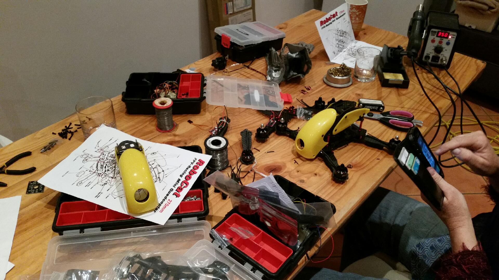

My sister has come to visit my wife and I from country New South Wales.  She is a science teacher and is frantically trying to learn robotics to be able to teach the kids.  Go figure she wanted to build a quadcopter ... so did I.
My Parrot is kaput and I will get back to fixing that but I did want to build something from scratch ... much more accomplishment there.
So, Robocat kits on Aliexpress are dirt cheap.  Sans battery and Rx but that is no problem.
So, I ordered two a couple of months ago.  They turned up pretty pronto and voila!
Day 1 of build.
So far, I worked out the assembly drawing is wrong in places (not too bad but needed some changes).  What you also need, if you are going to put ESC on arms (instead of inside bodies) is 50mm heat shrink as you will need to cut the shrink off the ESC, remove the wires and cut and strip motor wires to shorten the setup to fit on arms.  Carbon fibre is conductive so the shrink is essential.
Full shopping list tomorrow will be:

* 50mm heat shrink
* Heavier hobby soldering iron (the fancy soldering iron was okay for fine work but not really for the ESC)
* Wire cutters (lost them in move)
* Desoldering pump (lost it too)
* Desoldering wick (lost)
* Maybe a hot air gun (never had one of those)
* 2 3S batteries
* Small cable ties

The kit comes with a CC3D flight controller - not bad.  LibrePilot!  So, I might not put one of my [AIO](https://organicmonkeymotion.wordpress.com/2013/06/20/yin-and-yang/) on it after-all.  I will keep them for something else.
My wife also lucked into two trestle tables (one seen here in the dining area).  They are great as a hobby build bench (HBB).
She "allowed" this affront as my sister was visiting for 5 days!
I cannot, will not let my sister out geek me.

