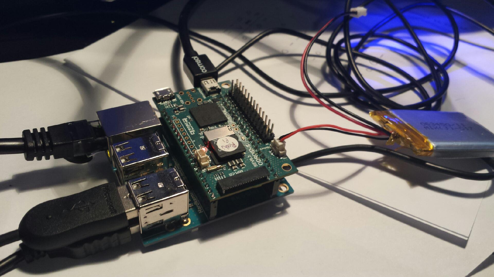
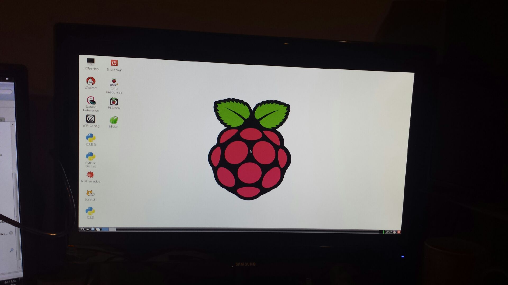
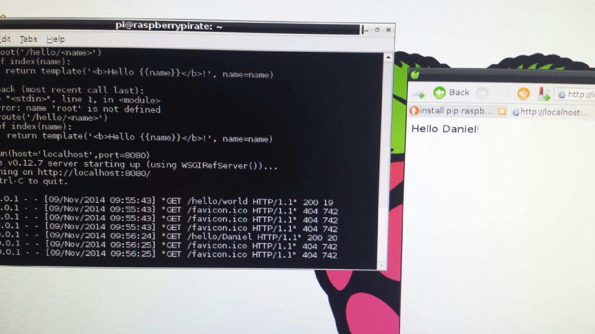

[caption id="attachment\_1661" align="aligncenter" width="450"] Battery charged ... check.  Click on the picture.  Go on.  Look at it close up.  I am spun out at the SD card size in comparison with the board.[/caption]
With my USB mouse and keyboard from Linux setup downstairs.  A bran spanking new black Ethernet cable plugged into my wireless extender.  Lights a flickering and:
[caption id="attachment\_1662" align="aligncenter" width="450"] A pretend Pi! (aka [Raspberry Pirate Arrrgh!](http://organicmonkeymotion.wordpress.com/2014/09/27/raspberry-pirates/ "Raspberry Pirates"))[/caption]
So, I was curious, having been lazy and buying an SD card from Hardkernel, but it was Raspbian...phew.
So I downloaded bottlepy (the web framework) and:
[caption id="attachment\_1663" align="aligncenter" width="450"] Hello Nephew![/caption]
No biggy but now I wait with bated breath for him to catch up.
In the meantime, I am writing up Part1 of LAB2 of the FPGA laboratories ... slowly, as I am deep in Masters Dissertation at the moment.
Also wik, I am looking at Processing on Android to build my 3D sensors (both line laser and structured light).  I have (almost) sorted the line laser driver which will run off a Seeduino film with Bluetooth.
I decided to switch because there is already a structured light program running in Processing and I have dibs on a LED pico projector from China for around $100.
Not to mention the bloggy omni-lens demo code is in Processing (and you'll recall I have three of those suckers now ;) - [yes](http://organicmonkeymotion.wordpress.com/2011/12/03/doh/ "DOH!!") [Yes](http://organicmonkeymotion.wordpress.com/2014/04/17/pixy-post-2/ "Pixy post 2") [YES!](http://organicmonkeymotion.wordpress.com/2014/05/02/now-thats-an-idea/ "Now that’s an idea!")
