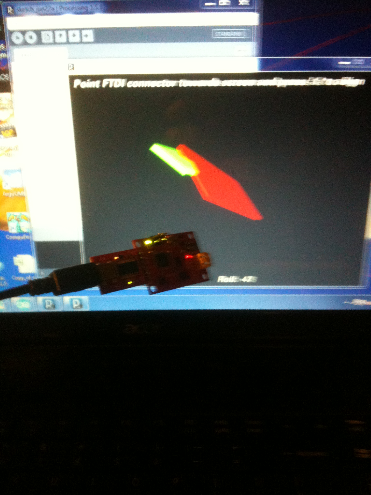

A little soldering and then using the 3v usb to FTDI gadget and viola!  Now (as long as you have that pesky Apple plug in)
[Testing Razor](http://organicmonkeymotion.wordpress.com/wp-content/uploads/2012/06/img_0103.mov) .
Nothing to brag about, someone else's hardware, someone else's code.
That's integration.
Well the real integration will be using the SPI port to hook into the mouse sensors.  There is code a diydrones to read the mouse sensor and it looks straight forward to add odometry to the Razor the same way they used the mouse sensor for a position hold for a quadcopter.

