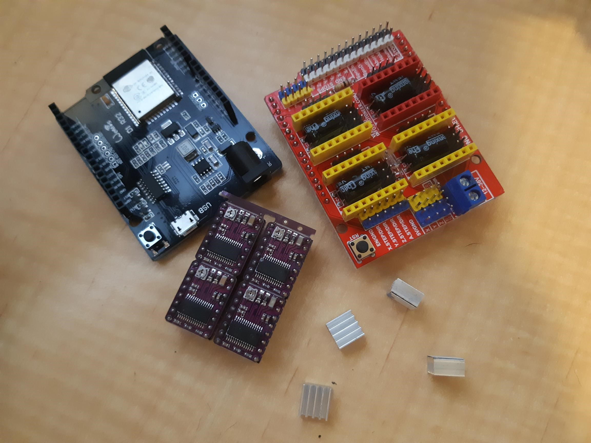
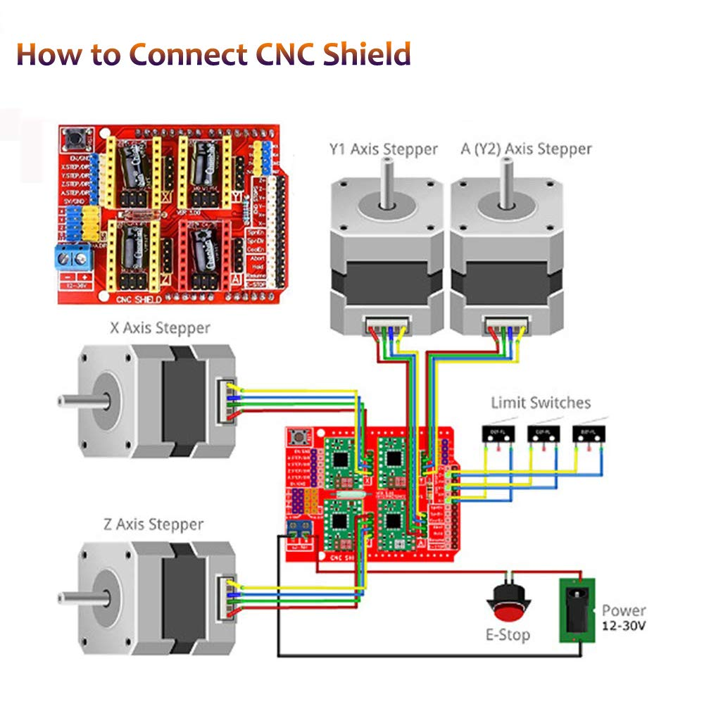
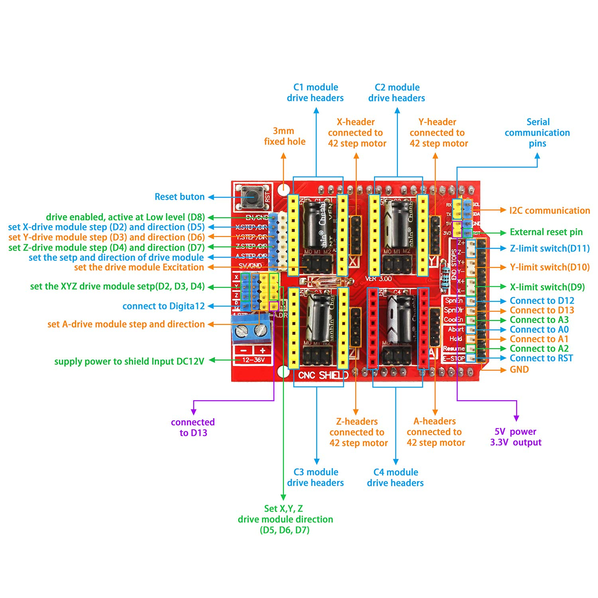
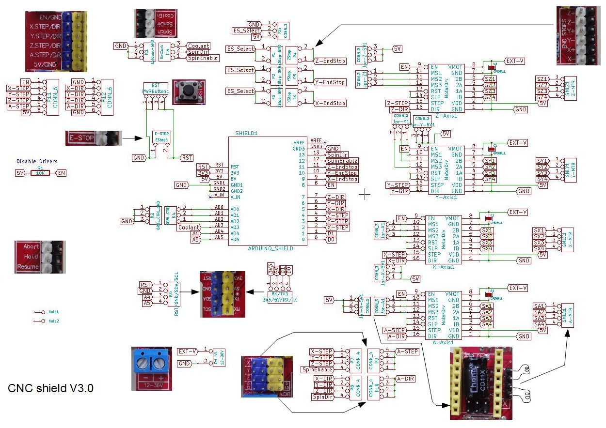
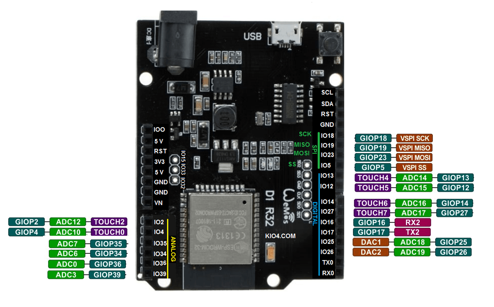
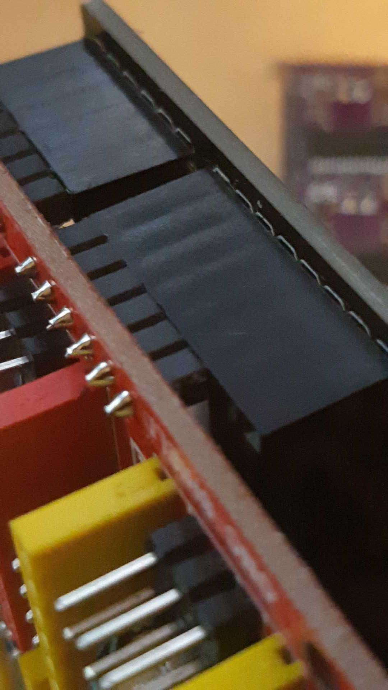
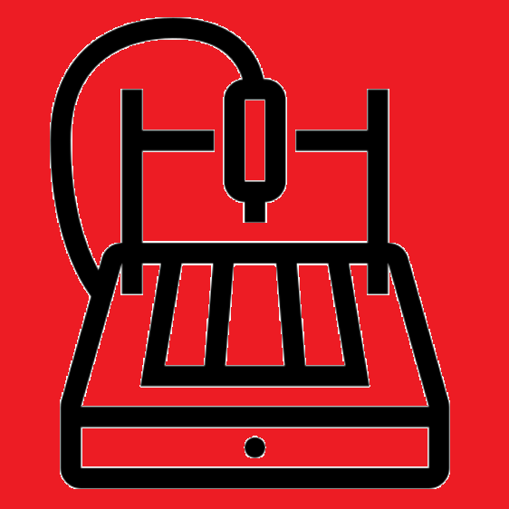

The CNC shield has turned up so I can now look at porting ESP32-GRBL to this board combination. Relatively straight forward I would imagine.

As [mentioned previously](https://organicmonkeymotion.wordpress.com/2021/03/22/no-grbls-harmed/), the ESP32-GRBL comes up an run fine on the Wemos D1 R32.

So, scouring the Net I found 3 useful diagrams to help sort out the porting.

A video version of this information, that may help digest the information, is:

https://www.youtube.com/watch?v=2N2A2F1HpNQ

Video 1

A good video to help setting up, at least with the UNO based setup (especially since I opted for DRV8825):

https://www.youtube.com/watch?v=OfyT1xTZC6o

Video 2

Remembering, however, in this build we're using the Wemos D1 R32 clone and so yet another diagram off the Net.

Notice that the D1 R32 has more header space (on both sides) by 2 pins aside. No problem of course. Same same for the UNO, if'n you watched the details in Video 1 above.

Now, of course, the conditioning circuitry may needed for the IO2, IO4, IO35, IO34, IO39 and IO39 pins (aka the UNO "Analog" pins). For digital level conversion it may be as simple as designing something around the [BSS138](https://dlnmh9ip6v2uc.cloudfront.net/datasheets/BreakoutBoards/BSS138.pdf) ([as described here](https://core-electronics.com.au/logic-level-converter-bi-directional.html?utm_source=google_shopping&gclid=Cj0KCQjwsLWDBhCmARIsAPSL3_2CyY1M5ipF1X1En9gMOo6ieiFpFzDSlWfH_Pah1Fjghqr0-2TTUYcaAitIEALw_wcB), thanks Core Electronics). We'll see.

The TI datasheet seems to suggest [driving the DRV8825 from 3.3Volt is fine](https://www.ti.com/lit/ds/symlink/drv8825.pdf?ts=1617798421827&ref_url=https%253A%252F%252Fwww.google.com%252F). Good old [pololu confirm this](https://www.pololu.com/product/2133) with a direct statement (bullet point 7 of the "Overview").

So far, nothing to suggest I need cut tracks or put in jumpers.

