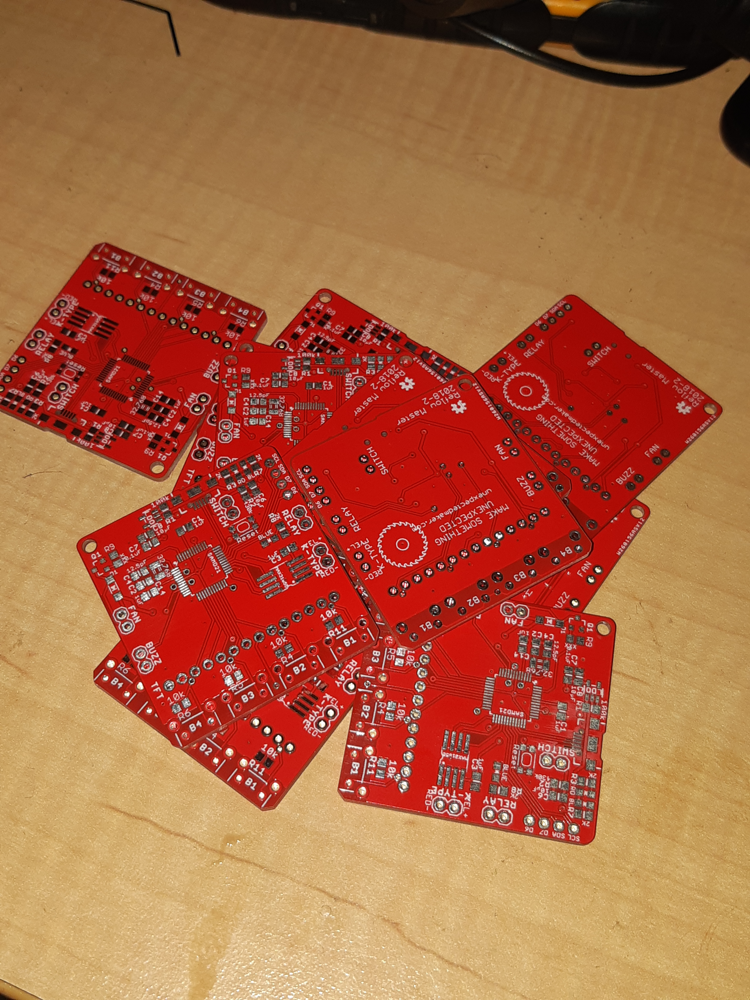

Figure 1

So, in Figure 1, the [Reflow Oven](https://github.com/UnexpectedMaker/ReflowMaster) pcb have turned up from PCBWay. I have ordered all parts and will need order a solder paste stencil (as I forgot to when ordering the boards). No rush for these as they will be the first boards to be assembled on my automatic PnP. Well, the 1st one off the run will need a roughed reflow approach. I'll set up a reflow oven with that first board and then run the other 9 through that.

I still need to finish the design of the Z-axis and, of course, build the PnP but that's coming up in my todo.
