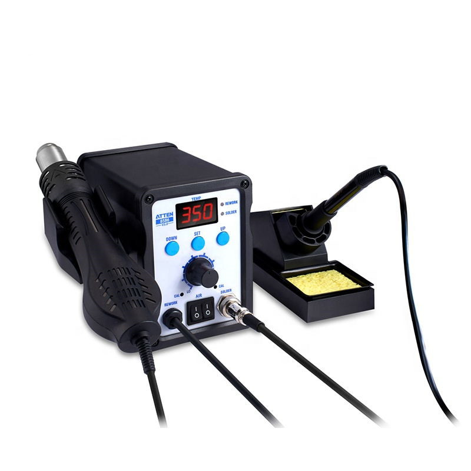

With all this work, setting up for building boards with SMD, I had plumb forgotten my old soldering station needed some attention. Not the least is a new soldering iron, for the station, and a collection of new bits.

So I (luckily) tracked down a new 7 hole 907 Soldering station iron handle with A1322 ceramic Heater 24V with 10 tip soldering iron tips. Plus I bought two extra luckydips of tips.

My good old ATTEN 8586.

