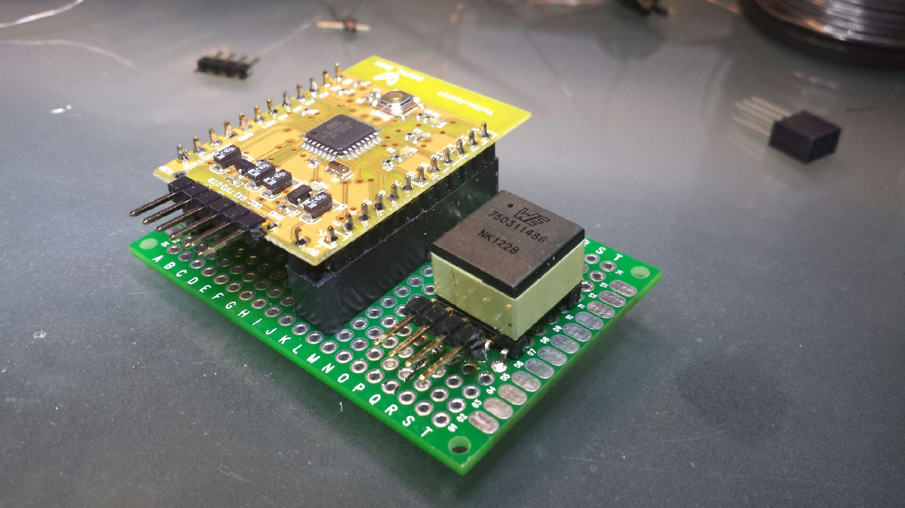
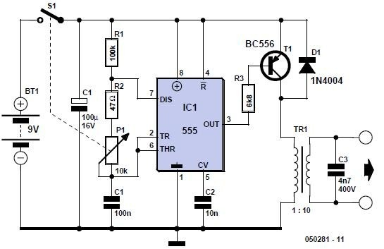
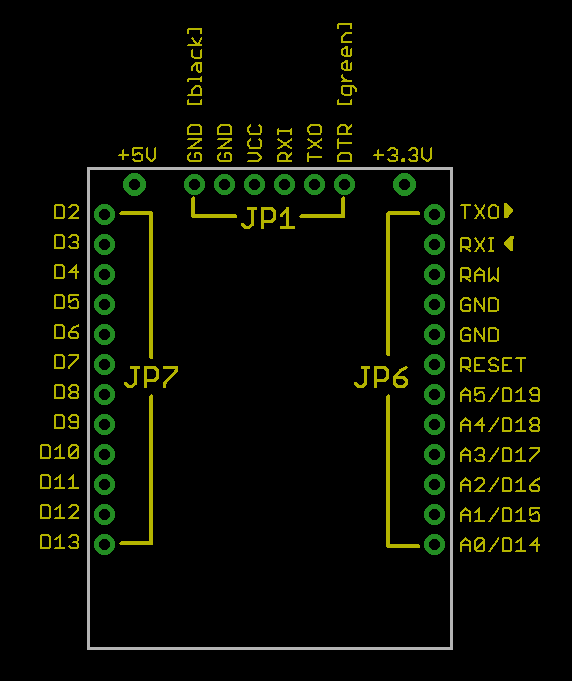

For a Zzzzzaappppppping good time.
[caption id="attachment\_1709" align="aligncenter" width="450"] TENS[/caption]
I bought a couple of YellowJacket (Arduino compatable with Wifi built in) yonks ago.  I do that ;)
So I thought I would dust one off to build a wireless controlled TENS gadget.
I came across a 555 based timer TENS circuit and it looked like a fun distraction from my Dissertation (an hour here or there don't you know).
[caption id="attachment\_1710" align="aligncenter" width="450"] Zzzzapp![/caption]
The Yellow Jacket looks like the ideal solution because it has on board power regulation including outputting 5V and 3.3V.
The 5V output will go to the emitter (the "arrow") on the transistor to drive the 1:10 transformer.
It turns out the [RS-232 connector I got for my BBB](https://www.sparkfun.com/products/9717 "Useful in a couple of places")s actually is a pin for pin match for  "JP1" that are on the YellowJacket.  Down to the regulated 5V required on that connector (the I/O on the cable is 3.3V which seemed to work fine).
The YellowJacket has a "raw" power input of 7-44V would you believe so I will solder a 9 volt battery connector to it to drive it.
[caption id="attachment\_1711" align="aligncenter" width="450"] YellowJacket pinnouts[/caption]
The one "trick" was all the docco claimed the YellowJacket was an "mini" as far as the programer was concerned.   Using Arduino 1.0 this did not work.  Nor did the "Uno" setting of some of the knock-offs (Chinese or otherwise).  Luckily, a little playing around and it uploaded fine with "Arduino NANO w/ Atmega328"
So, a few experiments with blinking lights etc. and all seems go for working on the pulse driver and webserver elements.
Now, I note you can still get these as Chinese knock-0ffs but they are about $50 seems over the top.  Although, other more recent gadgets might still be upwards of $50 for the MCU ([Electric IMP for example](https://electricimp.com/docs/gettingstarted/devkits/ "Hmmm")).  [Spark Photon](https://store.spark.io/ "Not bad.") is a likely good choice as it is only $20 - mind you, you wont need 120MHz for a TENS unit.  [RFduino](http://www.rfduino.com/product/rfd22102-rfduino-dip/ "Yeah, not bad.") maybe.
