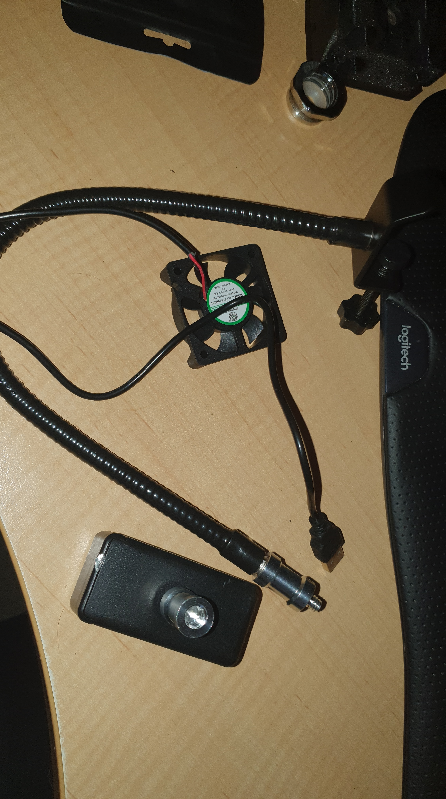
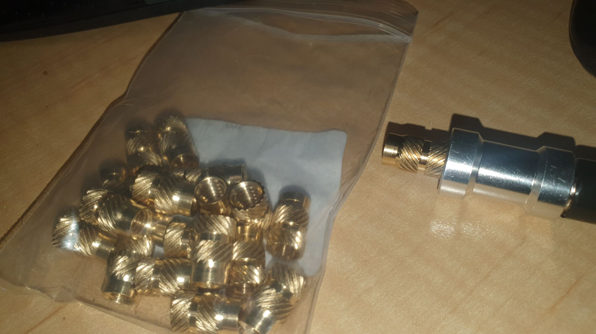

In the battle between Aliexpress and Temu for world dominance, I thought I'd pick up a couple of flexi phone holders, as I've a couple to three old phones that I use as OBS Studio as "DroidCAM" feeds. I have a full on SLR camera stand (with a phone holder as well), and a small desk tripod for a phone, but that still limits my viewing angles somewhat.

I also was after a USB fan to use to extract flux vapour while soldering. Thought, therefore, I might model up something in OpenSCAD to scale to whatever fan size you opt to use (within reason). Hence, I aim to co-opt the phone stand by including a heat set in the design of the fan holder, to allowing mounting the fan on the flex holder whenever I am soldering.

To wit, I've a packet of 1/4-20x12.7x8 heat sets on their way from Aliexpress because, you guessed it, my box(es) of M2-M6 are the wrong thread size.

**UPDATE**

Voila! The heat sets have turned up AND it seems my guess at thread type was correct.

In the process I worked out the thread of one of the holders is fragged. But you can buy a holder on its own (mitt 1/4-20 thread), and why not to a 1/4-20 tap and die. So I can fix the fragged holder, and have all the tools for any other adapters I feel like making.
