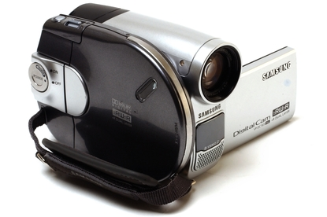

So, I have an [Acer Aspire One](https://en.wikipedia.org/wiki/Acer_Aspire_One).

I installed Debian 32bit on it ages ago and relatively recently did the final update to install the latest and last updates available.

Not so portable given the battery had long died.

Except! I came across a battery supplier in Australia that have replacements for all sorts of old bits of junk.

So, I have a battery for the Aspire One coming in the mail. I want to use the Aspire One as a general hack for connecting to instruments and 3D printers and especially the fancy high res camera I got for my astronomy dabblings.

I also have an old Samsung VP-DC163i camcorder. Long lost the charger. Managed to buy one from that same battery supplier.

Supplier is ... [Better Bat](http://So, I have a battery for the Aspire One coming in the mail.  I want it as a general hack for connecting to instruments and 3D printers and ...)!

Downside, when the camcorder battery was charged, and I tried the camcorder out, I found the viewing screen had been shattered on its right side. Not really useable as not much fun when driving the menu, since all the actual menu items you want to get to, to set parameters, happily sit under the shattered glass. DOH!. So default settings it is. And probably time is set to January 1 1970 etc. Also lost the av cable. You can still get them for around $50! So, looks like this one is for the bin. Too bad, so sad.
