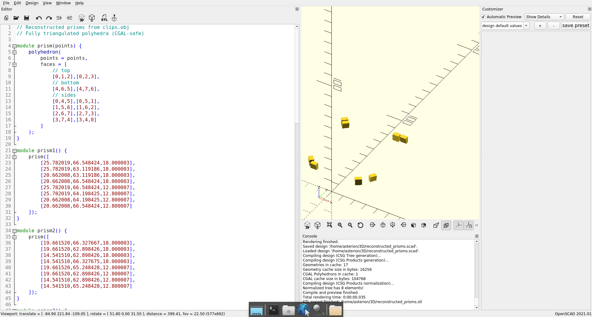
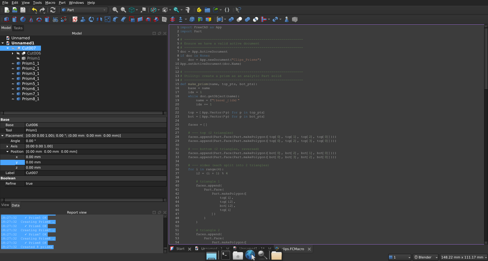
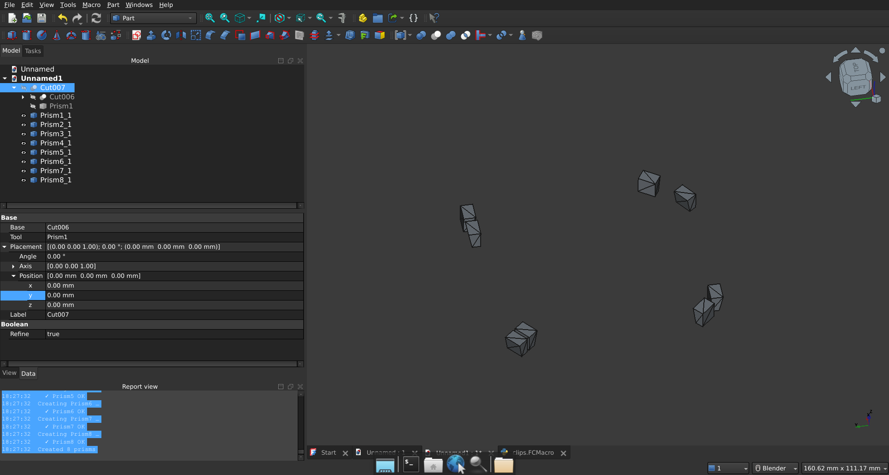
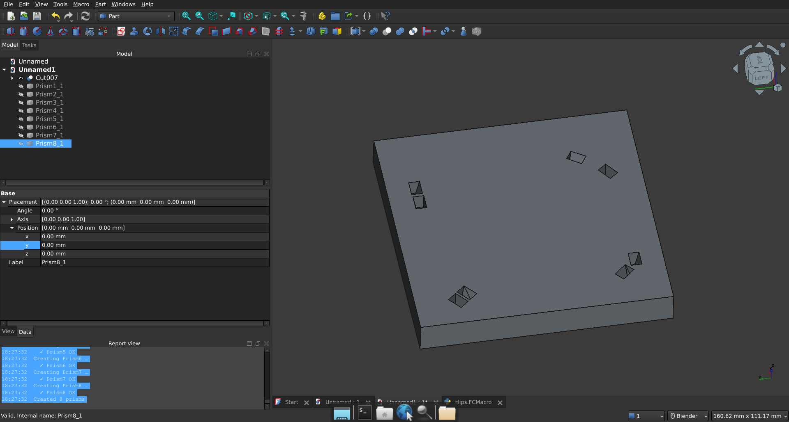
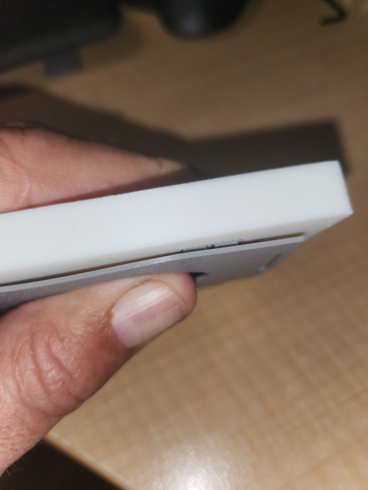

... of yawl.

While printing 12, 16 and another batch of 8mm versions of:

I elected to play with an idea that the design is great BUT what if it mounted on DIN rails. So, a homage to the original since I didn't want to re-design the lids and their clips (yawl can get those from the source).

Rather I wanted to reverse engineer the holes the clips fed into.

So I cheated.

I sucked the stl for the 8mm into blender. Deleted all the vertices cept those for the holes. Pumped it back out into an STL with only the holes. Pumped that up to ChatGPT to have it find the corners of the prisms representing the holes. Had some fun working some geometry issues I was stale on. Had ChatGPT craft an OpenSCAD file that nicely generated the prisms (its really that you have to relax and use triangles).

Then opted into a python script in FreeCAD (when it suddenly didn't make sense to import STL when you could create parts directly).

The long and the short of it, a few iterations with the FreeCAD script and now just waiting in queue, until a part batch of the original design, are printed and then I'll try a test print. It seems close as I dropped it over a real feeder body in Bambu Studio and the holes seemed to line up. The acid test is the perfect click into place the original has thanks to the cleverness of [Lord Asdi](https://www.printables.com/@LordAsdi_1250566) no less.

SOOO CLOSE! Me thinks the holds are about 1mm too shallow and there seems to be a case for arguing along one axis the holes are a tad closer together, so there's a minor buckling. However, brilliant first pass attempt.

I'll play with the depth first as the buckling could also be a function of the pegs not seated all the way. There's a hack of the current code that allows subtracting from the "bottom" of each prism as it's created.
