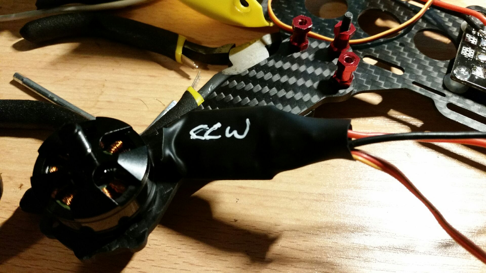

So, wife has gone to bed, so I have a vodka and soda in hand, while swapping the wiring and then the motors on the front of the Robocat - so that they turn the right way.

With trusty marker I have added a little reminder.  Note this is a motor rewired and re-heat shrunk and before the physical motor swap so eagle eyed readers need not concern themselves.
By the by, aliexpress has the CC3D Revolution flight controller (with the more spacious ARM chip) that can be used as a drone autopilot.  The CC3D with the kit is the older version and is an RC quad (without autopilot, return home, et cetera).  Good enough to get a handle on building and flying in any event.
